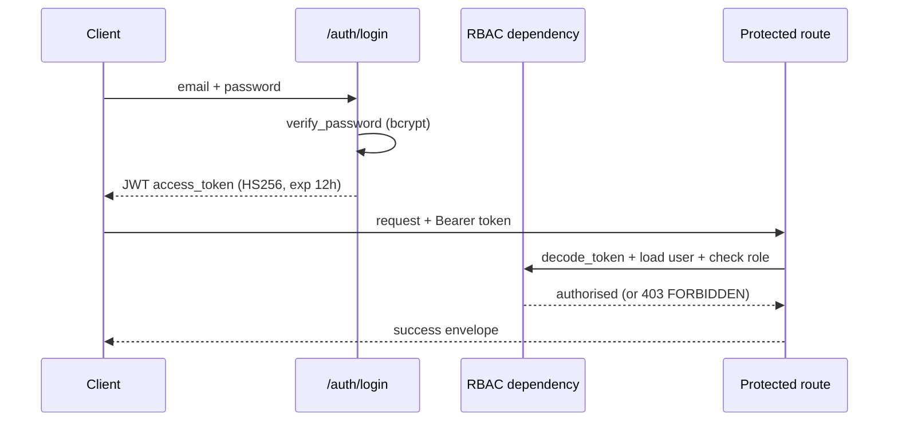

# Project Sentinel — Full Context Document

> **Purpose of this file:** a single, exhaustive, self-contained reference for
> onboarding a new environment, a new developer, or a new AI assistant session
> onto this codebase. It intentionally repeats information found in `README.md`,
> `QUICKSTART.md`, and `docs/*.md`, consolidated into one place, plus session
> history, known gotchas, and exact working credentials/commands verified live
> during development. If anything here conflicts with a more specific doc under
> `docs/`, treat this file as the "quick truth" and the specific doc as the
> "deep dive."

---

## 1. What Project Sentinel Is

Project Sentinel is an **agentic AI project co-ordinator** — a full-stack
web application (FastAPI backend + Next.js frontend) that helps teams plan,
execute, monitor, recover, and deliver software/other projects. It was built
as a hackathon project with an explicit anti-black-box philosophy:

> **AI assists human decisions. AI does not make unexplained decisions. AI
> does not invent project facts.**

Every computed value (schedule, risk score, health score, success
probability, resource allocation, etc.) is produced by a **deterministic,
pure-Python engine** — never guessed or hallucinated by an LLM. LLMs
(or, by default, a **deterministic mock LLM** — see §9) are used **only**
for language tasks: reading/summarising documents, asking clarifying
questions, drafting prose reports, and turning engine output into
human-readable explanations.

The rule of thumb baked into the whole codebase:

| Use a **deterministic engine** for… | Use an **LLM** only for… |
| --- | --- |
| Scheduling (CPM/PERT), critical path, float | Document understanding / fact extraction |
| Resource allocation & workload balancing | Summarisation |
| Dependency mapping, cycle detection | Clarifying questions to humans |
| Rule-based risk scoring | Report / stakeholder drafting |
| Project health, success probability | Meeting minutes |
| What-if / digital-twin simulation | Natural-language explanation of engine output |

Every engine and agent emits a shared `Explanation` object with:
`summary, reasoning, evidence, rules_triggered, calculations, assumptions,
alternatives, confidence, agent, timestamp` (defined in
`backend/app/engines/explain.py`). Every page in the frontend has an
**Explanation panel** showing this trace — "no recommendation is a black box"
is the actual product pitch.

---

## 2. Repository Location & Links

- **Local path (this machine):** `/Users/la20662849/Desktop/project-sentinel`
- **GitHub remote (private repo, created this session):**
  `https://github.com/heckerbob72-oss/project-sentinel`
  - HTTPS clone: `https://github.com/heckerbob72-oss/project-sentinel.git`
  - SSH clone: `git@github.com:heckerbob72-oss/project-sentinel.git`
  - GitHub account: `heckerbob72-oss` (email `heckerbob72@gmail.com`)
  - Git remote name: `origin`, default branch: `main`
  - Authenticated locally via the `gh` CLI (already logged in on this machine).
- **License:** MIT (`LICENSE` file at repo root).

To clone fresh in a new environment:

```bash
git clone https://github.com/heckerbob72-oss/project-sentinel.git
cd project-sentinel
```

---

## 3. Tech Stack

### Backend
- **Language/runtime:** Python. `pyproject.toml` declares `requires-python
  >=3.11`. In practice this has been run successfully on Python 3.11–3.14
  (the dev machine used Homebrew Python 3.14 via `requirements-local.txt`,
  which uses version ranges instead of pins so it resolves on newer
  interpreters).
- **Web framework:** FastAPI
- **ORM / migrations:** SQLAlchemy + Alembic (`backend/alembic/`,
  `backend/alembic.ini`, one migration so far: `0001_initial.py`)
- **Validation:** Pydantic v2 (`pydantic_settings.BaseSettings` for config)
- **Auth:** JWT (HS256, 12h expiry) + `passlib`/bcrypt (12 rounds) password
  hashing
- **Databases:** SQLite for local/dev/tests (`sqlite:///./sentinel.db`,
  zero-infra); PostgreSQL 16 for Docker/production
  (`postgresql+psycopg2://...`)
- **Cache/queue:** Redis + Celery (optional — the `worker` Docker service is
  off by default, `profiles: ["workers"]`)
- **Vector store (RAG):** ChromaDB 0.5.20, per-project namespaces
- **Agent orchestration:** LangGraph (optional — falls back to plain
  sequential Python function calls if not installed; behaviour is identical
  either way, just not visualised as a graph)
- **HTTP client:** httpx 0.28.1 (used for the GitHub import feature)
- **TLS trust (added this session):** `truststore` (0.10.4 in
  `requirements.txt`, `>=0.9` in `requirements-local.txt`) — see §14 "Known
  issues" for why this was necessary.
- **Linting:** ruff (`select E/F/I/UP/B`, `ignore E501/B008`, line-length 100,
  target `py311`)
- **Testing:** pytest (`backend/tests/`), coverage target 70%+ in CI, 80%+
  goal on engines specifically.

### Frontend
- **Framework:** Next.js 14.2.5, App Router
- **UI library:** React 18.3.1
- **Language:** TypeScript 5.5.3
- **Styling:** Tailwind CSS 3.4.6
- **Server state:** TanStack React Query 5.51.1
- **Client state:** Zustand 4.5.4 (with `persist` middleware → browser
  `localStorage`)
- **Validation:** Zod 3.23.8
- **Charts:** Recharts 2.12.7 (health gauges, timelines, etc.)
- **Diagrams:** React Flow 11.11.4 (dependency graph, knowledge graph)
- **Icons:** lucide-react
- **Utility:** clsx + tailwind-merge

### Infra / DevOps
- **Docker Compose** (`docker-compose.yml`) — full stack: Postgres, Redis,
  Chroma, backend, frontend (+ optional worker profile)
- **CI:** GitHub Actions (`.github/workflows/ci.yml`) — two jobs:
  - `backend`: installs `requirements.txt`, runs `ruff check app` (non-blocking,
    `|| true`), runs `pytest --cov=app --cov-report=term-missing
    --cov-fail-under=70` against a throwaway SQLite DB with a dummy
    `SECRET_KEY`.
  - `frontend`: `npm ci || npm install`, `npm run lint` (non-blocking),
    `npm run build`.
  - Triggers: push/PR to `main` or `develop`.

---

## 4. High-Level Architecture

Three strictly separated layers:

1. **Engines** (`backend/app/engines/`) — deterministic, pure-Python,
   no LLM calls, no I/O beyond what's passed in. Given the same input they
   always produce the same output. This is the "trustworthy math" layer.
2. **Agents** (`backend/app/agents/`) — the language/orchestration layer.
   Agents read/write structured state, may call an LLM for language tasks,
   but **delegate every computation to an engine**. Agents never compute a
   number themselves.
3. **API routers** (`backend/app/api/routers/`) — the transport layer.
   Thin FastAPI route handlers that validate input (Pydantic), call
   agents/engines, wrap output in the standard envelope, and log to the
   audit trail.

```mermaid
flowchart LR
    UI[Next.js Frontend] -->|REST /api/v1| API[FastAPI Routers]
    API --> AG[Agents\n(LLM + orchestration)]
    AG --> EN[Engines\n(deterministic math)]
    AG --> RAG[RAG pipeline\n(ChromaDB)]
    API --> DB[(SQLAlchemy ORM\nSQLite/Postgres)]
    AG --> DB
    EN --> EXP[Explanation object]
    AG --> EXP
    EXP --> API
```

### API response envelope

**Success:**
```json
{
  "status": "success",
  "data": { "...": "..." },
  "explanation": { "summary": "...", "reasoning": "...", "evidence": [...],
                   "rules_triggered": [...], "calculations": {...},
                   "assumptions": [...], "alternatives": [...],
                   "confidence": 0.9, "agent": "RiskAgent",
                   "timestamp": "..." },
  "audit_id": "...",
  "next_actions": ["..."]
}
```

**Error** (raised via `SentinelError` in `backend/app/core/exceptions.py`):
```json
{
  "status": "error",
  "error_code": "VALIDATION_ERROR",
  "message": "...",
  "details": {...},
  "suggested_action": "..."
}
```

---

## 5. Directory / File Structure — Role of Every Major Piece

```
project-sentinel/
├── docker-compose.yml     Full-stack orchestration (db, redis, chroma, backend, frontend, worker)
├── Makefile               Dev shortcuts: up/down/seed/backend/frontend/test/lint/clean
├── run.sh                 One-command local (no-Docker) bootstrap script
├── QUICKSTART.md           Fresh-machine setup guide (no Docker), demo logins, smoke test
├── README.md               Project pitch, philosophy, engine table, agent list, quick starts
├── LICENSE                 MIT
├── .env.example            Template env vars for Docker Compose
├── .github/workflows/ci.yml  CI: backend lint+test, frontend lint+build
│
├── backend/
│   ├── Dockerfile           Backend container build
│   ├── pyproject.toml       Package metadata, pytest config, coverage config, ruff config
│   ├── requirements.txt     FULL prod stack: Postgres driver, LangGraph, ChromaDB, Celery
│   ├── requirements-local.txt  LEAN stack: SQLite-only, no compiled deps, version ranges (Py3.11–3.14)
│   ├── alembic.ini          Alembic config
│   ├── alembic/
│   │   ├── env.py           Alembic migration environment (reads DATABASE_URL, imports models)
│   │   ├── script.py.mako   Migration template
│   │   └── versions/0001_initial.py   The one migration: creates the full 40-ish table schema
│   ├── storage/1/…          Local file storage backend (uploaded documents), per-project subfolders
│   ├── tests/
│   │   ├── conftest.py      Pytest fixtures — IMPORTANT: shares the same DB engine as the running
│   │   │                    dev app, so running pytest wipes & reseeds the live SQLite dev DB!
│   │   ├── api/…             API-level tests (auth, projects, planning, intake, import, agents, etc.)
│   │   └── engines/…         Pure-function tests for each deterministic engine
│   └── app/
│       ├── main.py           FastAPI app factory: middleware (CORS, rate limiter), router registration,
│       │                     startup events, `/health` endpoint
│       ├── config.py         `Settings` (pydantic-settings) — all env-driven config, see §7
│       ├── database.py       SQLAlchemy engine/session factory, declarative Base
│       │
│       ├── agents/           19 explainable agents (language + orchestration layer) — see §11
│       │   ├── __init__.py     `AGENT_REGISTRY` dict mapping agent name → class
│       │   ├── analysis.py     DocumentAnalysisAgent, GapDetectionAgent
│       │   ├── base.py         Shared `BaseAgent` contract (name, purpose, run(), Explanation emission)
│       │   ├── comms.py        ReportingAgent, ExecutiveCopilotAgent, MeetingMinutesAgent
│       │   ├── planning.py     IntakeAgent, ProjectDNAAgent, WorkBreakdownAgent, ResourceAllocationAgent,
│       │   │                   DependencyAgent, TimelineAgent, plus GitHubImportAgent (import wizard)
│       │   ├── risk_health.py  RiskAgent, HealthAgent, SuccessAgent, RecoveryAgent, RescueAgent,
│       │   │                   NextBestActionAgent
│       │   └── templates.py    Prompt/response templates used by agents when calling the LLM
│       │
│       ├── api/
│       │   ├── deps.py         Shared FastAPI dependencies: `get_db`, `get_current_user`,
│       │   │                   `require_permission(...)` (RBAC), etc.
│       │   └── routers/        REST endpoints — see §12 for the full list
│       │       ├── __init__.py    Aggregates all routers (including `ALL_ROUTERS` from misc.py) under
│       │       │                  a single `api_router` with the `/api/v1` prefix
│       │       ├── auth.py        Register / login / me
│       │       ├── projects.py    Project CRUD
│       │       ├── planning.py    WBS / dependencies / timeline / resources
│       │       ├── insight.py     Risks / health / success / recovery
│       │       ├── extra.py       Members / methodology / DNA / gaps / rescue / summary / reports
│       │       ├── import_.py     Import-wizard endpoints (GitHub import, text import, generate-plan) —
│       │       │                  built + debugged this session, see §16
│       │       ├── simulations.py Digital-twin simulation endpoint
│       │       ├── agents.py      Generic agent runner + full-workflow trigger
│       │       ├── documents.py   Document upload + RAG search
│       │       └── misc.py        Aggregates smaller routers: methodology recommend, intake, reports,
│       │                          executive draft, meeting minutes, explainability, portfolio,
│       │                          knowledge-graph, lessons-learned, audit, admin
│       │
│       ├── core/
│       │   ├── audit.py        Writes to the `audit_logs` table on every material action
│       │   ├── exceptions.py   `SentinelError` + subclasses, mapped to the error envelope
│       │   ├── rbac.py         `Role`, `Permission` enums + `ROLE_PERMISSIONS` matrix + `has_permission()`
│       │   ├── response.py     Success-envelope helper(s)
│       │   └── security.py     `create_access_token`, `decode_token`, password hash/verify (bcrypt)
│       │
│       ├── engines/            8 deterministic engines — see §13
│       │   ├── scheduling.py    CPM + PERT timeline/critical-path
│       │   ├── dependency.py    DAG construction, cycle detection (DFS), topological sort (Kahn)
│       │   ├── resource.py      Skill-matched allocation, capacity, SPOF/backup detection
│       │   ├── risk.py          YAML-rulebook-driven risk scoring
│       │   ├── risk_rules.yaml  The actual risk rulebook (condition → risk definition)
│       │   ├── health.py        11-weighted-dimension project health score
│       │   ├── success.py       Weighted delivery-success probability model
│       │   ├── simulation.py    Digital-twin what-if engine (re-runs scheduling+health on mutated state)
│       │   ├── methodology.py   Rule-based methodology recommender (Waterfall/Scrum/Kanban/Hybrid) + PMBOK map
│       │   └── explain.py       Shared `Explanation` dataclass used by every engine & agent
│       │
│       ├── integrations/
│       │   └── github.py        Read-only GitHub REST API client (`fetch_github_repo`, `parse_repo_slug`).
│       │                        MODIFIED this session to use `truststore.SSLContext` for TLS verification
│       │                        (corporate-proxy fix, see §14).
│       │
│       ├── llm/
│       │   ├── base.py          `LLMProvider` abstract interface
│       │   ├── factory.py       `get_llm()` — returns `MockLLM()` unless `llm_provider=="openai"` and an
│       │   │                    API key is set (lazy import); azure/ollama currently fall back to mock too
│       │   └── mock.py          `MockLLM` — deterministic canned/templated responses so the whole app
│       │                        works fully offline with zero API keys
│       │
│       ├── models/              SQLAlchemy ORM models (one file per domain area)
│       │   ├── base.py           Declarative base + shared mixins (timestamps, soft-delete)
│       │   ├── user.py           User, Role, Permission, UserRole
│       │   ├── project.py        Project, ProjectDNA, ProjectMethod, ProjectTemplate
│       │   ├── document.py       Document, DocumentChunk, DocumentSource
│       │   ├── team.py           Team, Member, Skill, MemberSkill, Availability
│       │   ├── work.py           WBSItem, Task, TaskDependency, Allocation, Milestone
│       │   ├── risk.py           Risk, RiskRule, Mitigation, RecoveryPlan
│       │   ├── report.py         Report, MeetingMinutes, ActionItem
│       │   ├── simulation.py     Simulation, SimulationResult, HealthScore
│       │   ├── knowledge.py      PortfolioProject, KnowledgeNode, KnowledgeEdge, LessonsLearned
│       │   └── audit.py          AuditLog
│       │
│       ├── rag/                  Retrieval-Augmented Generation pipeline — see §15
│       │   ├── chunking.py       Splits extracted text into retrieval-sized chunks, preserving location
│       │   ├── embeddings.py     Embedding model wrapper
│       │   ├── pipeline.py       Orchestrates upload→validate→extract→chunk→embed→store→search→cite
│       │   └── store.py          ChromaDB client wrapper (per-project namespace)
│       │
│       ├── schemas/               Pydantic request/response schemas
│       │   ├── auth.py            Register/login/token schemas
│       │   ├── common.py          Shared envelope/pagination schemas
│       │   ├── planning.py        `IntakeRequest` and other planning-endpoint schemas (the fix this
│       │   │                      session made `submit_intake` use `IntakeRequest` instead of a bare dict)
│       │   └── project.py         Project create/update/response schemas
│       │
│       ├── seed/
│       │   ├── run_seed.py        Entry point: `python -m app.seed.run_seed`
│       │   ├── sample_documents.py  Sample document content for RAG demo
│       │   └── seed_data.py       All seed data: 5 demo users (see §8), risk rules, 3 demo projects,
│       │                          a 4-person team, a 6-task WBS with dependencies, portfolio/lessons/
│       │                          knowledge-graph samples, an audit record
│       │
│       ├── workers/
│       │   └── celery_app.py      Celery app definition (used by the optional `worker` Docker service)
│       │
│       └── workflows/
│           └── graph.py           LangGraph `PlanningState` TypedDict + the sequential planning pipeline:
│                                  document analysis → gap detection → intake → project DNA →
│                                  methodology → WBS → resource allocation → dependency → timeline →
│                                  risk → health → success → recovery → next best action → reporting.
│                                  Falls back to plain function calls if LangGraph isn't installed —
│                                  behaviour is identical either way.
│
├── frontend/
│   ├── Dockerfile            Frontend container build
│   ├── package.json          Scripts: dev/build/start/lint; deps listed in §3
│   ├── next.config.js, tailwind.config.ts, postcss.config.js, tsconfig.json
│   ├── public/               Static assets
│   └── src/
│       ├── app/               One folder per route (Next.js App Router), plus root layout/page/providers:
│       │   admin/ audit/ control-tower/ dashboard/ dependencies/ executive/ explainability/ gantt/
│       │   gap-analysis/ health/ intake/ knowledge-graph/ lessons-learned/ login/ meeting-minutes/
│       │   methodology/ portfolio/ project-dna/ project-summary/ recovery/ register/ reports/ rescue/
│       │   resources/ risks/ settings/ simulation/ team-planner/ timeline/ wbs/
│       │   (layout.tsx sets up dark theme, Sidebar, TopNav around every page; the `intake/` route hosts
│       │   the project-import wizard — see §16)
│       ├── components/
│       │   ├── ComingSoon.tsx, DependencyGraph.tsx, ExplanationPanel.tsx (renders the Explanation
│       │   │   object on every page), GanttChart.tsx, HealthGauge.tsx, NextBestActions.tsx, RiskMatrix.tsx
│       │   ├── layout/  AuthGate.tsx (redirects unauthenticated users to /login), Sidebar.tsx, TopNav.tsx
│       │   └── ui/      Badge, Button, Card, EmptyState, Modal, Skeleton, Spinner, StatusBadge, Table, Toast
│       ├── lib/
│       │   ├── api.ts          Typed fetch wrapper for the backend `/api/v1` API (attaches JWT header)
│       │   ├── types.ts        Shared TypeScript types mirroring backend schemas
│       │   └── utils.ts        Misc helpers (formatting, cn() class merge, etc.)
│       └── store/               Zustand stores (all persisted to localStorage)
│           ├── useAuthStore.ts     key "sentinel-auth" — JWT token + current user
│           ├── useProjectStore.ts  key "sentinel-project" — selectedProjectId / selectedProjectName
│           └── useUIStore.ts       UI-only state (sidebar collapse, theme, etc.)
│
├── docs/                     20 markdown docs with Mermaid diagrams — deep dives per subsystem:
│   ARCHITECTURE.md (system structure, container + data-flow diagrams), AGENT_DESIGN.md (full agent
│   table + contract), API.md, CONTRIBUTING.md, DATABASE.md (schema conventions + table groups),
│   DECISION_LOG.md, DEPENDENCY_ENGINE.md, DEPLOYMENT.md, JUDGE_EXPLAINABILITY.md (demo walkthrough for
│   hackathon judges), METHODOLOGY_ENGINE.md, PROJECT_HEALTH.md, RAG.md (pipeline + citation contract),
│   RESOURCE_ENGINE.md, RISK_ENGINE.md, SCHEDULING_ENGINE.md, SECURITY.md (controls + RBAC matrix +
│   auth flow), SETUP.md, SIMULATION_ENGINE.md, TESTING.md
│
├── data/README.md            Notes on the `data/` folder (placeholder for external datasets)
├── deployment/                nginx.conf + README for a reverse-proxy production deployment
├── docker/README.md           Notes on the Docker setup
├── samples/
│   ├── hackathon_brief.txt    Sample project brief document — used to test Document Analysis + RAG
│   ├── sample_project.json    A portable project (team/tasks/dependencies) POST-able to planning endpoints
│   └── smoke_test.py          Pure-stdlib end-to-end smoke test — logs in and exercises EVERY engine and
│                              agent through the live API, printing ✓/✗ per check. Run with:
│                              `python samples/smoke_test.py` (backend must be running).
│                              Override target: `SENTINEL_API=http://localhost:8010/api/v1 python samples/smoke_test.py`
└── scripts/dev.sh             Dev helper script
```

---

## 6. Environment Variables / Configuration

All backend configuration lives in `backend/app/config.py`'s `Settings`
class (pydantic-settings, loads from a `.env` file or the process
environment). Defaults shown are what ships in the repo:

| Variable | Default | Notes |
| --- | --- | --- |
| `APP_NAME` | `Project Sentinel` | |
| `API_V1_PREFIX` | `/api/v1` | All routes are mounted under this |
| `ENVIRONMENT` | (dev) | |
| `DEBUG` | `True` | |
| `DATABASE_URL` | `sqlite:///./sentinel.db` | Set to `postgresql+psycopg2://...` for Docker/prod |
| `SECRET_KEY` | (must override in prod) | JWT signing key |
| `JWT_ALGORITHM` | `HS256` | |
| `ACCESS_TOKEN_EXPIRE_MINUTES` | `720` (12h) | |
| `BCRYPT_ROUNDS` | `12` | |
| `CORS_ORIGINS` | `["http://localhost:3000","http://127.0.0.1:3000"]` | |
| `REDIS_URL` | (redis service) | Only needed if using Celery workers |
| `CHROMA_HOST` / `CHROMA_PORT` | `8001` (Docker maps container's 8000→8001) | |
| `CHROMA_PERSIST_DIR` | `./.chroma` | Used when running Chroma embedded/local instead of a server |
| `LLM_PROVIDER` | `mock` | Set to `openai` + `OPENAI_API_KEY` to use a real LLM |
| `LLM_MODEL` | `gpt-4o-mini` | |
| `OPENAI_API_KEY` / `OPENAI_BASE_URL` | unset | |
| `AZURE_OPENAI_ENDPOINT` / `AZURE_OPENAI_API_KEY` | unset | Stubbed — currently falls back to mock |
| `OLLAMA_BASE_URL` | `http://localhost:11434` | Stubbed — currently falls back to mock |
| `STORAGE_BACKEND` | `local` | |
| `STORAGE_DIR` | `./storage` | |
| `S3_BUCKET` / `S3_ENDPOINT_URL` | unset | Only relevant if `STORAGE_BACKEND=s3` |
| `MAX_UPLOAD_MB` | `25` | |
| `ALLOWED_UPLOAD_EXTENSIONS` | `pdf,docx,txt,csv,json,md` | |
| `RATE_LIMIT_PER_MINUTE` | `120` | |

Root `.env.example` (for Docker Compose) sets:
```
POSTGRES_USER=sentinel
POSTGRES_PASSWORD=sentinel
POSTGRES_DB=sentinel
SECRET_KEY=change-me-in-production-please-32bytes-min
LLM_PROVIDER=mock
NEXT_PUBLIC_API_URL=http://localhost:8000/api/v1
```

Frontend uses `NEXT_PUBLIC_API_URL` (copy `frontend/.env.local.example` to
`frontend/.env.local` if you need to point at a non-default backend port).

**The whole system is designed to run with zero external services and zero
API keys** — SQLite + mock LLM + local file storage is the default path.

---

## 7. How To Run

### Option A — Docker Compose (full stack, recommended for parity with prod)

```bash
cp .env.example .env
docker compose up --build
```

- Frontend → http://localhost:3000
- API docs (Swagger) → http://localhost:8000/docs
- Health check → http://localhost:8000/health

Services started: `db` (postgres:16-alpine), `redis` (redis:7-alpine),
`chroma` (chromadb/chroma:0.5.20, exposed on host port 8001), `backend`
(builds `./backend`; on start it runs `alembic upgrade head`, then
`python -m app.seed.run_seed`, then `uvicorn app.main:app --host 0.0.0.0
--port 8000`), `frontend` (builds `./frontend`, port 3000). The `worker`
(Celery) service exists but is **off by default** — it's under the
`workers` Docker Compose profile, so it must be explicitly enabled:
`docker compose --profile workers up`.

### Option B — Local, zero-infra (no Docker, no Postgres)

The backend defaults to SQLite + mock LLM, so this needs nothing installed
beyond Python and Node.

**One command:**
```bash
bash run.sh                                   # → http://localhost:8000/docs
# second terminal:
cd frontend && npm install && npm run dev     # → http://localhost:3000
```

`run.sh` creates a `.venv`, installs `backend/requirements-local.txt` (the
lean, SQLite-only, no-compiled-deps requirement set with version ranges that
work on Python 3.11 through 3.14), runs the seed script, and starts uvicorn
with `--reload`.

**By hand:**
```bash
cd backend
python3 -m venv .venv && source .venv/bin/activate
pip install -r requirements-local.txt   # SQLite-only, no compiling
python -m app.seed.run_seed             # seeds 3 demo projects + 5 users
uvicorn app.main:app --reload
```

> ⚠️ Use `requirements-local.txt` for local dev (no Postgres driver, installs
> cleanly on Python 3.14). Use `requirements.txt` (full stack: Postgres,
> LangGraph, ChromaDB, Celery) only with Docker or Python 3.11/3.12 — it may
> fail to build on very new Python versions due to compiled dependencies.

### Makefile shortcuts

```bash
make up        # docker compose up --build
make down      # docker compose down
make seed      # run the seed script
make backend   # run the backend locally (no Docker)
make frontend  # run the frontend locally
make test      # pytest -q
make lint      # ruff check app
make clean     # remove build artifacts / venvs / caches
```

### Verifying the whole thing end-to-end

With the backend running, from repo root:
```bash
python samples/smoke_test.py
```
This is a pure-stdlib script (no pip installs needed) that logs in and
exercises **every engine and agent** through the live REST API — auth,
projects, CPM timeline, dependency DAG, risk rules, health, success
probability, resources, methodology, DNA, gaps, rescue, recovery, document
upload + RAG citations, digital-twin simulation, the full multi-agent
workflow, meeting minutes, executive draft, and the audit/explainability
trail. It prints a ✓/✗ line per check and a final `RESULT: N passed, 0
failed`. Point it at a different port with
`SENTINEL_API=http://localhost:8010/api/v1 python samples/smoke_test.py`.

### Backend tests

```bash
cd backend && pytest --cov=app --cov-report=term-missing
```

⚠️ **Important gotcha:** `backend/tests/conftest.py` shares the **same
database engine** as whatever the app is currently configured to use. If you
run pytest against your local dev setup (SQLite `sentinel.db`), **it will
wipe and reseed your live dev database** as part of test fixture setup. If
you want to preserve manually-entered dev data, either point `DATABASE_URL`
at a separate test DB when running pytest, or re-run
`python -m app.seed.run_seed` afterward to restore known-good demo data.

### Resetting a broken/stale database

```bash
rm -f backend/sentinel.db && cd backend && python -m app.seed.run_seed
```

---

## 8. Demo / Test Login Credentials

These come from `backend/app/seed/seed_data.py`'s `SEED_USERS` and are
created automatically by `python -m app.seed.run_seed`. **Do not guess these
— they've been wrong-guessed before; these exact values are verified.**

| Role | Email | Password | Display name |
| --- | --- | --- | --- |
| Admin | `admin@sentinel.dev` | `admin123` | Ava Admin |
| Project Manager | `pm@sentinel.dev` | `pm123456` | Priya Manager |
| Team Lead | `lead@sentinel.dev` | `lead1234` | Leo Lead |
| Contributor | `dev@sentinel.dev` | `dev12345` | Dana Dev |
| Viewer | `view@sentinel.dev` | `view1234` | Val Viewer |

You can also register a new account via the **Register** page (`/register`);
self-registered users get the `TeamLead` role by default, which has
`PROJECT_CREATE` permission so they can bootstrap their own first project.

### Using Swagger UI (`/docs`) to get a token

1. `POST /api/v1/auth/login` with body `{"email":"pm@sentinel.dev",
   "password":"pm123456"}`
2. Copy the returned `access_token`
3. Click **Authorize** in Swagger UI, paste the token
4. Try `GET /projects/1/timeline`, `/risks`, `/health`, `/rescue`, or
   `POST /projects/1/simulations` with
   `{"scenario":"deadline_shortened","params":{"days":3}}`

---

## 9. Seed / Demo Data

Running the seed script (`python -m app.seed.run_seed`) creates:

- **5 users** (see §8) with roles/permissions wired up
- **Risk rules** loaded from `backend/app/engines/risk_rules.yaml`
- **3 demo projects**, each showing a different health state (per
  `QUICKSTART.md`'s suggested tour):
  1. **"Project Sentinel Demo"** (id 1) — hackathon-type project,
     `start=2026-08-01`, `deadline=start+9d`, `intake_completeness=0.85`,
     team_size 4, several deliverables. Shown as **amber** — a tight testing
     window.
  2. **"Customer Portal Revamp"** (id 2) — shown as **green** — comfortable
     schedule/health.
  3. **"Q3 Data Migration"** (id 3) — shown as **red / rescue-mode active**
     — deliberately unhealthy to demo the Rescue Mode agent/UI. Switch the
     project selector to this project to see rescue mode fire.
- A **4-person team** for the demo project: Asha Rao (Backend), Ben Cole
  (Frontend), Chen Li (AI Engineer), Dev Shah (Designer/QA), each with
  skills and availability.
- A **6-task WBS** for the demo project with dependencies: T-01 Ideation →
  T-02 Build backend → T-03 Build frontend → T-04 Agent workflow → T-05
  Integration testing → T-06 Demo/pitch.
- Portfolio, lessons-learned, and knowledge-graph sample records.
- One audit log record.

Suggested UI tour (per `QUICKSTART.md`): **Dashboard → Work Breakdown →
Timeline → Dependencies → Risk Register → Health → Digital Twin Lab (run a
scenario) → Explainability → Control Tower → Portfolio → Rescue Mode**
(switch to *Q3 Data Migration* to see rescue mode).

---

## 10. Database

SQLAlchemy ORM models + Alembic migrations. SQLite locally/tests, Postgres
16 in Docker/prod. Conventions applied to every table:

- Surrogate `id` primary key
- Explicit, **indexed** foreign keys
- `created_at` / `updated_at` timestamps on every table
- Soft delete via an `is_deleted` flag (never physically deletes rows, so
  audit history is preserved)
- `JSON` columns for flexible/semi-structured payloads (e.g. an agent's
  `Explanation` object, agent I/O, settings)
- ORM-only access everywhere — **no raw SQL** anywhere in the codebase, so
  all queries are parameterised by construction (SQL-injection safe by
  design)

Tables, grouped by domain:

| Group | Tables |
| --- | --- |
| Identity & access | `users`, `roles`, `permissions`, `user_roles` |
| Projects & profiling | `projects`, `project_dna`, `project_methods`, `project_templates` |
| Documents & RAG | `documents`, `document_chunks`, `document_sources` |
| Team & capacity | `teams`, `members`, `skills`, `member_skills`, `availability` |
| Planning | `wbs_items`, `tasks`, `task_dependencies`, `allocations`, `milestones` |
| Risk & recovery | `risks`, `risk_rules`, `mitigations`, `recovery_plans` |
| Reporting & meetings | `reports`, `meeting_minutes`, `action_items` |
| Simulation & health | `simulations`, `simulation_results`, `health_scores` |
| Portfolio & knowledge | `portfolio_projects`, `knowledge_nodes`, `knowledge_edges`, `lessons_learned` |

Note: `Project` model columns and the `project.profile` JSON blob are two
separate, sometimes-inconsistent data sources — each can report a different
"completeness" number. Be careful which one a given piece of UI/agent logic
is reading from when debugging discrepancies.

---

## 11. Agents (19, in `backend/app/agents/`, registered in `AGENT_REGISTRY`)

Every agent shares a common contract (`backend/app/agents/base.py`): a
stable `name`, one-line `purpose`, Pydantic-validated input/output schemas,
delegation of all computation to a deterministic engine, audit logging of
every run, a `confidence` score (0..1 — high for engine-backed work, lower
for LLM-authored prose), and emission of the shared `Explanation` object.
**Golden rule: if a value can be computed, an engine computes it** — the LLM
only turns structured output into language, extracts facts from documents,
or asks humans for missing info.

| Agent | Purpose | Key inputs | Key outputs | Deterministic backing |
| --- | --- | --- | --- | --- |
| **Document Analysis** | Extract structured project facts from uploaded docs | Document chunks (via RAG) | Extracted facts + citations | RAG retrieval + citation contract |
| **Gap Detection** | Find missing info needed to plan | Extracted facts, required fields | List of gaps/open questions | Deterministic completeness check |
| **Intake** | Collect human answers to gaps | Gap list, human answers | Completed intake record | Completeness recomputed |
| **Project DNA** | Profile project characteristics | Facts, intake | Project profile/DNA | Deterministic profiling → drives Methodology |
| **Methodology** | Recommend delivery methodology | Project DNA | Methodology + PMBOK map | **Methodology engine** |
| **Work Breakdown** | Build the WBS | Scope, intake, DNA | WBS items/tasks | Structural decomposition; LLM names only |
| **Resource Allocation** | Assign members to tasks | Tasks, members, skills | Assignments, utilisation, gaps | **Resource engine** |
| **Dependency** | Establish/validate dependencies | Tasks, hints | DAG, cycles, bottlenecks, SPOF | **Dependency engine** |
| **Timeline** | Schedule the plan | Tasks (O/M/P), deps, deadline | ES/EF/LS/LF, float, critical path, Gantt | **Scheduling engine** |
| **Risk** | Detect risks from metrics | Computed metrics | Ranked risks w/ evidence | **Risk engine** (YAML rulebook) |
| **Health** | Score overall project health | Deterministic metrics | 0-100 score, band, drivers | **Health engine** |
| **Success** | Delivery success probability | Metrics | Probability + drivers | **Success engine** |
| **Recovery** | Recommend recovery actions | Risks, health, schedule | Recovery plan | Deterministic rules over risk/health |
| **Rescue** | Coordinate rescue mode | Health < 50, risks | Rescue plan | Triggered by health rescue threshold |
| **Next Best Action** | Single most valuable next step | Health, risks, gaps | Prioritised action list | Deterministic prioritisation |
| **Reporting** | Draft status/exec reports | Structured state | Report draft | LLM drafts; numbers from engines |
| **Executive Copilot** | Answer exec questions in plain language | State, RAG | Grounded answers | LLM for language, grounded in evidence |
| **Meeting Minutes** | Summarise meetings, extract action items | Transcript/notes | Minutes + action items | LLM summarisation; items structured |
| **Judge Explainability** | Prove any recommendation is grounded | Any prior output | Explanation trace | Replays engine Explanation |
| **GitHub Import** *(added prior session)* | Import repo facts to seed a project | Repo URL | Normalised project facts | Deterministic parsing of GitHub API data |
| **Digital Twin Simulation** | Run what-if scenarios | Baseline state, scenario | Before/after deltas, new risks | **Simulation engine** |

(Note: README lists 19 named agents; the registry additionally includes the
GitHub Import agent built in a prior session for the import-wizard feature,
bringing the practical count to ~20.)

---

## 12. Engines (8, in `backend/app/engines/`)

Deterministic, pure-Python, unit-tested independently of the API. This is
the "not a black box" core of the product.

| Engine | Does | Key math/logic |
| --- | --- | --- |
| **Scheduling** (`scheduling.py`) | Timeline, critical path | PERT `(O + 4M + P) / 6`; CPM forward/backward pass; float = `LS - ES` |
| **Dependency** (`dependency.py`) | DAG, cycles, SPOF | DFS cycle detection; Kahn's algorithm for topological sort |
| **Resource** (`resource.py`) | Skill-matched allocation | match score = `coverage * 0.7 + (expertise / 5) * 0.3`; capacity-aware |
| **Risk** (`risk.py` + `risk_rules.yaml`) | Rule-based risk detection | YAML rulebook; risk score = `Probability * Impact / 25 * 100` |
| **Health** (`health.py`) | 0–100 project health | Weighted sum across 11 dimensions; rescue mode triggers below 50 |
| **Success** (`success.py`) | Delivery success probability | Transparent weighted model (weights ~25/20/20/15/10/10 across dimensions) |
| **Simulation** (`simulation.py`) | Digital-twin what-ifs | Re-runs the real scheduling + health engines on a mutated copy of state |
| **Methodology** (`methodology.py`) | Waterfall/Scrum/Kanban/Hybrid recommendation | Rule-based decision tree + PMBOK process-group mapping |
| **Explain** (`explain.py`) | Shared explanation contract | Not a "scoring" engine — defines the `Explanation` dataclass used everywhere |

---

## 13. RAG (Retrieval-Augmented Generation) — `backend/app/rag/`

Turns uploaded project documents into a searchable, **citation-backed**
knowledge base. Grounds the Document Analysis and Executive Copilot agents.
Defining property: **it never fabricates a citation** — if retrieval finds
no supporting chunk, it says so explicitly.

Pipeline: **Upload** (pdf/docx/txt/csv/json/md) → **Validate** (type
allowlist, 25MB size limit, path-traversal-safe filename) → **Extract
text** → **Chunk** (preserving document/page/section location) → **Embed**
→ **Store** in ChromaDB under a **per-project namespace** (so one project
can never retrieve another project's documents) → **Search** (embed query,
semantic search within that project's namespace) → **Cite or decline**.

Citation format:
```json
{
  "document": "charter.pdf",
  "page": 2,
  "section": "Timeline",
  "chunk_id": "c_014",
  "snippet": "…delivery by 30 June 2026…"
}
```

If no match is found above the similarity threshold, the response is the
literal message: *"No supporting source was found in the uploaded
documents."* — never a guessed answer.

---

## 14. Security & RBAC

Implemented in `backend/app/core/security.py`, enforced by FastAPI
dependencies, configured via env vars. Principles: least-privilege,
defence-in-depth, secrets never in code.

| Control | Implementation |
| --- | --- |
| Authentication | JWT HS256 signed with `SECRET_KEY`; `sub`/`iat`/`exp` claims; 12h default lifetime; `create_access_token` / `decode_token` |
| Password hashing | bcrypt via passlib `CryptContext`, cost configurable (`BCRYPT_ROUNDS`, default 12), constant-time verification |
| Authorisation (RBAC) | FastAPI dependency (`require_permission`) on protected routes; roles: Admin, ProjectManager, TeamLead, Contributor, Viewer |
| Input validation | All bodies are Pydantic models — malformed input rejected before business logic (`VALIDATION_ERROR`) |
| File-upload validation | Type allowlist, size limit, path-traversal-safe filenames |
| Rate limiting | Per-client cap, default 120/min → `RATE_LIMITED` on breach |
| CORS | Explicit origin allowlist (`CORS_ORIGINS`) |
| SQL-injection safety | ORM-only DB access, no raw SQL anywhere |
| Audit logging | Every agent run + material change written to `audit_logs` with its `Explanation` — tamper-evident trail |
| Secrets management | All secrets from env vars only; `SECRET_KEY` **must** be overridden in production |

### Auth flow


### RBAC roles/permissions (`backend/app/core/rbac.py`)

Roles: `Admin`, `ProjectManager`, `TeamLead`, `Contributor`, `Viewer`.
Permissions: `PROJECT_CREATE`, `PROJECT_EDIT`, `DOCUMENT_UPLOAD`,
`TASK_EDIT`, `RISK_APPROVE`, `REPORT_GENERATE`, `ADMIN_SETTINGS`,
`AUDIT_VIEW`.

| Capability | Admin | PM | Team Lead | Contributor | Viewer |
| --- | :---: | :---: | :---: | :---: | :---: |
| View projects/reports/health | ✅ | ✅ | ✅ | ✅ (own) | ✅ (own) |
| Create/edit projects | ✅ | ✅ | ✅ (create only*) | ❌ | ❌ |
| Upload documents & run RAG | ✅ | ✅ | ✅ | ✅ | ❌ |

\* `TeamLead` was given `PROJECT_CREATE` in a prior session specifically so
self-registered users (who default to `TeamLead`) can bootstrap their own
first project without needing an admin to create it for them.

`has_permission(role, permission)` is the check function;
`require_permission(permission)` is a FastAPI dependency factory that
raises `403 FORBIDDEN` if the current user's role lacks the permission.

---

## 15. Full API Endpoint Reference (all under `/api/v1` prefix)

| Router file | Method & Path | Notes |
| --- | --- | --- |
| `auth.py` | `POST /auth/register` | 201 on success |
| | `POST /auth/login` | Returns JWT access_token |
| | `GET /auth/me` | Current user info |
| `projects.py` | `GET /projects` | List projects |
| | `POST /projects` | Create project |
| | `GET /projects/{id}` | Project detail |
| | `PATCH /projects/{id}` | Update project |
| `planning.py` | `POST /wbs` | Create WBS items |
| | `POST /dependencies` | Create dependencies |
| | `POST /timeline` | Compute/persist timeline |
| | `GET /projects/{id}/wbs` | Get WBS |
| | `GET /projects/{id}/dependencies` | Get dependency graph |
| | `GET /projects/{id}/timeline` | Get computed timeline/Gantt |
| | `GET /projects/{id}/resources` | Get resource allocation |
| `insight.py` | `GET /projects/{id}/risks` | Ranked risk list |
| | `GET /projects/{id}/health` | Health score/band/drivers |
| | `GET /projects/{id}/success` | Success probability |
| | `GET /projects/{id}/recovery` | Recovery plan |
| `extra.py` | `GET /projects/{id}/members` | Team members |
| | `GET /projects/{id}/methodology` | Methodology recommendation |
| | `GET /projects/{id}/dna` | Project DNA profile |
| | `GET /projects/{id}/gaps` | Open gaps/questions |
| | `GET /projects/{id}/rescue` | Rescue plan (if triggered) |
| | `GET /projects/{id}/summary` | Project summary |
| | `GET /projects/{id}/reports` | Existing reports |
| `import_.py` | `POST /projects/{id}/import/github` | Import facts from a public GitHub repo (uses `truststore` for TLS) |
| | `POST /projects/{id}/import/text` | Import facts from pasted free text |
| | `POST /projects/{id}/generate-plan` | Generate full plan (WBS+deps+timeline+members) from imported/merged facts |
| `simulations.py` | `POST /projects/{id}/simulations` | Run a digital-twin what-if scenario |
| `agents.py` | `GET /agents` | List all registered agents |
| | `POST /agents/{agent_name}/run` | Run one agent directly |
| | `POST /agents/workflow/plan` | Run the full LangGraph planning pipeline |
| `documents.py` | `POST /projects/{id}/documents` | Upload a document (feeds RAG) |
| | `GET /projects/{id}/rag/search` | Semantic search within a project's documents |
| `misc.py` → `methodology_router` | `POST /methodology/recommend` | Standalone methodology recommendation |
| `misc.py` → `intake_router` | `POST /intake/{project_id}` | Submit intake answers (body: `IntakeRequest`) |
| `misc.py` → `reports_router` | `POST /projects/{id}/reports` | Generate a report |
| `misc.py` → `exec_router` | `POST /executive/draft` | Executive summary draft |
| `misc.py` → `minutes_router` | `POST /meeting-minutes/generate` | Generate meeting minutes from a transcript |
| `misc.py` → `explain_router` | `GET /explainability/{audit_id}` | Replay an Explanation trace |
| `misc.py` → `portfolio_router` | `GET /portfolio` | Portfolio-level view across projects |
| `misc.py` → `knowledge_router` | `GET /knowledge-graph/{project_id}` | Knowledge graph nodes/edges |
| `misc.py` → `lessons_router` | `GET /lessons-learned` | Lessons-learned records |
| `misc.py` → `audit_router` | `GET /audit` | Audit log |
| `misc.py` → `admin_router` | `GET /admin/users` | Admin user list |

Root-level: `GET /health` (outside `/api/v1`, container/orchestration health
check). Interactive docs at `GET /docs` (Swagger UI) and `GET /redoc`.

---

## 16. The Project-Import Wizard Feature (built prior session, debugged this session)

A guided flow (frontend: `intake/` route) that lets a user seed a new
project from either:
1. **A public GitHub repository URL** — `POST /projects/{id}/import/github`
   fetches repo metadata (description, primary language, README headings,
   star count, etc.) via `backend/app/integrations/github.py`, normalises it
   into project facts, and merges them into the project's intake/profile.
2. **Free-form pasted text** — `POST /projects/{id}/import/text` extracts
   bullet-style facts from arbitrary text.
3. Either path can be followed by **`POST /projects/{id}/generate-plan`**,
   which takes the merged facts and produces a full WBS, task dependencies,
   a computed timeline, and persisted team members — effectively
   auto-populating an entire project plan from a single import.

There's also a "New Project" creation flow (`NewProjectCard` component in
`intake/page.tsx`) and a file-upload tab (also in `intake/page.tsx`'s
`fileMutation`) for attaching documents during intake — both exist in the
UI but have **not yet been exercised/verified live in the browser** as of
the end of this session (still on the todo list).

### Bugs found & fixed in this feature during this session

1. **Intake answers-wrapper bug** (`backend/app/api/routers/misc.py`,
   `submit_intake`): the endpoint accepted a bare `answers: dict =
   Body(default={})` parameter. Without `embed=True`, FastAPI treats a bare
   `dict` param as "the entire JSON body," so `team_members` and other
   fields were being nested under a stray `"answers"` key instead of merged
   as top-level profile keys — meaning gap-detection never saw them and the
   "team members" gap never cleared. **Fix:** changed the parameter to
   `body: IntakeRequest` (an already-defined-but-unused Pydantic schema from
   `backend/app/schemas/planning.py`) and used `body.answers` explicitly.
   Verified via curl (completeness went 32%→37% correctly) and a live
   Playwright browser test (chip cleared, completeness and gap count updated
   correctly).

2. **`_persist_members` type-mismatch 500** (`backend/app/api/routers/
   import_.py`): `_persist_members(db, project_id, team_members: list[dict])`
   called `.get("name")` on each entry, but entries could arrive as plain
   strings (e.g. `["Asha", "Ben"]`) instead of dicts, raising
   `AttributeError: 'str' object has no attribute 'get'` → an unhandled 500.
   **Symptom in the browser was a misleading generic CORS error**, not a
   visible 500 — because the app's rate-limiter middleware
   (`BaseHTTPMiddleware`-based) sits in front of `CORSMiddleware`, so an
   unhandled exception below it never gets CORS headers attached, and
   browsers report the resulting response as a CORS failure rather than
   showing the real 500. **Fix:** normalise each entry — `tm = raw if
   isinstance(raw, dict) else {"name": raw}` — before calling `.get()`.
   Verified via an in-process `TestClient(app, raise_server_exceptions=True)`
   script (bypasses the generic error page to show the real traceback) and a
   live browser test navigating through to `/timeline` with a correct Gantt
   chart (6 tasks, 21.0d duration, all on the critical path).

3. **GitHub import SSL failure** (`backend/app/integrations/github.py`):
   `fetch_github_repo` failed with `[SSL: CERTIFICATE_VERIFY_FAILED]` even
   though `certifi` was installed. Root cause: the dev machine sits behind a
   **corporate Zscaler TLS-inspecting proxy** that issues certificates from
   a "wipro ltd" root CA — trusted by macOS's system keychain (which is why
   plain `curl`/browser traffic worked) but **absent from Python's
   `certifi` bundle** (which is why `httpx`/`requests` failed). **Fix:**
   added the `truststore` package and used `truststore.SSLContext(ssl.
   PROTOCOL_TLS_CLIENT)` — which delegates certificate verification to the
   OS-native trust store instead of `certifi` — as the `verify=` parameter
   for the `httpx.Client`, plus `follow_redirects=True` since
   `api.github.com` can issue a 301. This is scoped to the Python venv/app
   (no `sudo`, no OS-level trust-store modification). Verified via a direct
   in-process call to `fetch_github_repo('https://github.com/tiangolo/
   fastapi')` (returned real data — 100,932 stars, correct description) and
   a live browser test showing "Imported successfully."

**If working on a similar corporate-network machine in the future and
seeing `CERTIFICATE_VERIFY_FAILED` for outbound HTTPS calls that work fine
in the browser/`curl`, check for a corporate MITM/TLS-inspection proxy
first and reach for `truststore` rather than trying to patch `certifi`.**

---

## 17. Testing

- **Backend:** `pytest` in `backend/tests/`. `api/` subfolder covers
  endpoint-level behaviour (auth, projects, planning, intake, import,
  agents, etc.); `engines/` subfolder covers pure-function engine logic
  directly (CPM, PERT, DAG, risk, health, resource, simulation, methodology,
  success) with an 80%+ coverage target on engines specifically, 70%+
  overall enforced in CI (`--cov-fail-under=70`).
- **Frontend:** `npm run lint` (non-blocking in CI) and `npm run build`
  (must succeed) — no dedicated frontend test suite currently in the repo.
- **End-to-end smoke test:** `python samples/smoke_test.py` (see §7) —
  pure-stdlib, exercises the whole live API surface.
- **CI:** GitHub Actions `.github/workflows/ci.yml`, two parallel jobs
  (`backend`, `frontend`) triggered on push/PR to `main`/`develop`.

⚠️ Reminder: running backend pytest against your local dev SQLite DB will
reseed it (see §7's gotcha note).

---

## 18. Known Issues / Gotchas (accumulated across sessions)

1. **pytest wipes the dev DB.** `backend/tests/conftest.py` shares the
   live app's DB engine — running the test suite resets/reseeds
   `backend/sentinel.db`. Re-run `python -m app.seed.run_seed` afterward if
   you need the standard demo data back.
2. **Never guess seed passwords** — check `seed_data.py` (or
   `conftest.py`) directly; a wrong guess previously wasted debugging time
   (correct PM password is `pm123456`, not something similar-looking).
3. **`Project` model columns vs. `project.profile` JSON blob** are two
   separate, sometimes-inconsistent sources of "completeness"/profile data —
   confirm which one a given code path reads before assuming a bug.
4. **Bare `dict` FastAPI body params swallow the whole JSON body** unless
   you use a proper Pydantic schema (or `embed=True`) — this caused the
   intake wrapper bug (§16.1). Prefer defined schemas for any endpoint with
   a specific body shape/contract.
5. **Browser-reported CORS errors can mask real unhandled 500s** when a
   `BaseHTTPMiddleware`-based middleware (e.g. this app's rate limiter) sits
   in front of `CORSMiddleware` — an exception raised below that middleware
   never gets CORS headers attached, so the browser shows a generic CORS
   failure instead of the real server error. When debugging a "CORS error"
   on a previously-working-CORS endpoint, check for an actual 500 first
   (curl the endpoint directly, or use `TestClient(app,
   raise_server_exceptions=True)` in a one-off script to get the real
   traceback).
6. **Corporate MITM/TLS-inspection proxies** (e.g. Zscaler) break Python's
   `certifi`-based TLS verification for outbound HTTPS even though the OS
   trust store (and therefore curl/browsers) trusts the proxy's CA. Fix:
   use the `truststore` package's `SSLContext` for `httpx`/`requests`
   verification instead of `certifi`, scoped to the app — no system-wide
   changes needed.
7. **`requirements.txt` vs `requirements-local.txt`:** the full
   `requirements.txt` (Postgres driver `psycopg2`, LangGraph, ChromaDB,
   Celery) can fail to build on very new Python versions (e.g. 3.14) due to
   compiled dependencies — use `requirements-local.txt` for local dev
   (SQLite-only, version ranges, no compiling) or run the full stack via
   Docker instead.
8. **Port conflicts:** if port 8000 is taken, run `uvicorn app.main:app
   --reload --port 8010` and set `NEXT_PUBLIC_API_URL=http://localhost:8010/
   api/v1` for the frontend to match.
9. Two UI flows in the import wizard have **not yet been verified live in
   the browser**: the file-upload tab (`fileMutation` in `intake/page.tsx`)
   and the "New Project" creation flow (`NewProjectCard` component). These
   remain open follow-up items.

---

## 19. Session Changelog (this development session, in order)

1. Fixed the intake answers-wrapper bug (`misc.py` — `submit_intake` now
   uses the `IntakeRequest` schema). Verified via curl + live browser test.
2. Fixed the "Generate Plan" 500 error caused by `_persist_members` calling
   `.get()` on plain strings (`import_.py`). Verified via `TestClient` +
   live browser test (Gantt chart rendered correctly).
3. Diagnosed and fixed the GitHub import SSL failure by adding `truststore`
   to `backend/app/integrations/github.py` and both requirements files.
   Verified via direct script call + live browser test.
4. Ran the full backend pytest suite (38 tests) repeatedly after each fix —
   all passing.
5. Recorded all bug/fix/gotcha details in repo-scoped agent memory
   (`/memories/repo/project-sentinel.md`).
6. Initialized a new git repository at the project root, verified
   `.gitignore` correctly excludes secrets/build artifacts/venvs/DB files,
   committed 207 files ("Initial commit: Project Sentinel"), and created +
   pushed a **private** GitHub repository via `gh repo create project-
   sentinel --private --source=. --remote=origin --push` to
   `https://github.com/heckerbob72-oss/project-sentinel`.
7. Wrote this `CONTEXT.md` file for onboarding a new environment (current
   step) and committed/pushed it to the same GitHub repo.

---

## 20. Outstanding / Next Steps

- [ ] Verify the **file-upload tab** in the import wizard live in the
      browser (`fileMutation` in `frontend/src/app/intake/page.tsx`).
- [ ] Verify the **"New Project" creation flow** live in the browser
      (`NewProjectCard` component in the same file).
- [ ] Consider reading the remaining deep-dive docs under `docs/` (`API.md`,
      `CONTRIBUTING.md`, `DECISION_LOG.md`, `DEPENDENCY_ENGINE.md`,
      `DEPLOYMENT.md`, `JUDGE_EXPLAINABILITY.md`, `METHODOLOGY_ENGINE.md`,
      `PROJECT_HEALTH.md`, `RESOURCE_ENGINE.md`, `RISK_ENGINE.md`,
      `SCHEDULING_ENGINE.md`, `SETUP.md`, `SIMULATION_ENGINE.md`,
      `TESTING.md`) for even deeper subsystem-specific detail if extending
      those areas.
- [ ] If wiring a real LLM provider (OpenAI), set `LLM_PROVIDER=openai` and
      `OPENAI_API_KEY` in `.env` — Azure/Ollama support is stubbed and
      currently always falls back to the mock LLM regardless of config.

---

## 21. Quick Reference Cheat-Sheet

```bash
# Clone
git clone https://github.com/heckerbob72-oss/project-sentinel.git
cd project-sentinel

# Fastest local run (no Docker)
bash run.sh                                    # backend → :8000
cd frontend && npm install && npm run dev      # frontend → :3000 (separate terminal)

# Full stack via Docker
cp .env.example .env
docker compose up --build                      # frontend :3000, backend :8000

# Demo login (Project Manager — most permissions relevant to daily use)
# email: pm@sentinel.dev   password: pm123456

# Verify everything works
python samples/smoke_test.py                   # end-to-end smoke test
cd backend && pytest --cov=app                 # unit/API tests (⚠ resets dev DB)

# Reset a broken DB
rm -f backend/sentinel.db && cd backend && python -m app.seed.run_seed
```
