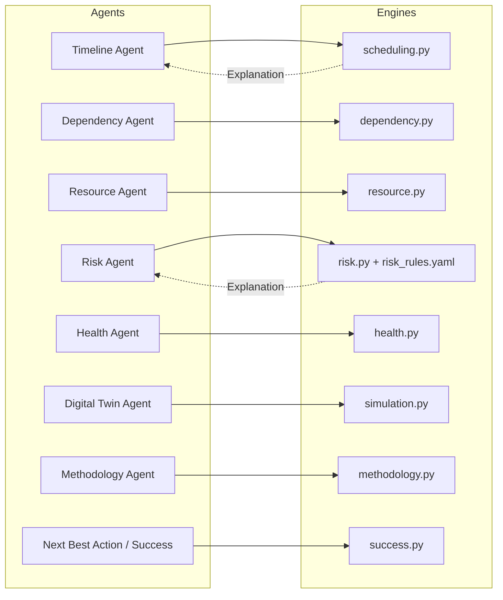
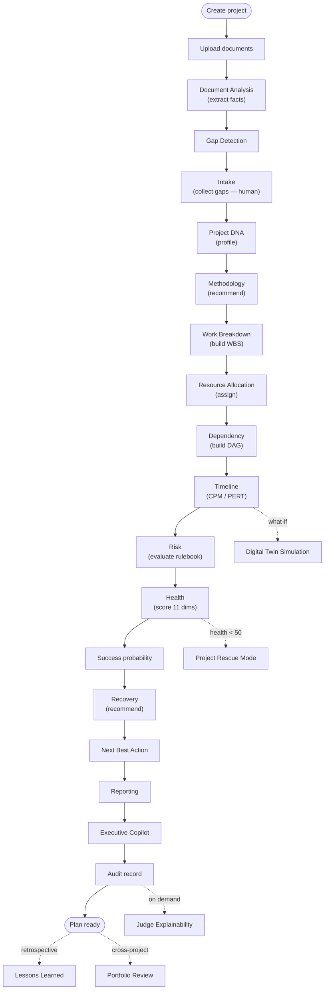

# Project Sentinel — Agent Design

Sentinel's agents live in `backend/app/agents/` and are orchestrated by **LangGraph** workflows in `backend/app/workflows/`. Agents are the *language and orchestration* layer: they read and write structured state, call an LLM **only** for language tasks (understanding, summarising, asking clarifying questions, drafting prose), and **delegate every computation to a deterministic engine**.

## Agent Contract

Every agent shares a common contract:

- **name** — stable identifier.
- **purpose** — one-line responsibility.
- **input schema / output schema** — Pydantic-validated structured payloads.
- **deterministic checks** — computations delegated to engines (never guessed).
- **audit logging** — each run is recorded (`agent_runs`, `audit_logs`).
- **confidence** — 0..1; high for engine-backed work, lower for LLM-authored language.
- **explanation** — the shared `Explanation` object (summary, reasoning, evidence, rules_triggered, calculations, assumptions, alternatives, confidence, agent, timestamp).

The golden rule: **if a value can be computed, an engine computes it.** The LLM is used to turn structured engine output into readable language, to extract facts from documents, and to ask humans for missing information.

## The Agents

| Agent | Purpose | Key inputs | Key outputs | Deterministic checks / engine used |
| --- | --- | --- | --- | --- |
| **Document Analysis** | Extract structured project facts from uploaded documents | Document chunks (via RAG) | Extracted facts + citations | RAG retrieval + citation contract (no fabricated citations) |
| **Gap Detection** | Find missing information needed to plan | Extracted facts, required-field set | List of gaps / open questions | Deterministic completeness check → `requirement_completeness` |
| **Intake** | Collect answers to gaps from humans | Gap list, human answers | Completed intake record | Completeness recomputed; human-in-the-loop |
| **Work Breakdown** | Build the Work Breakdown Structure | Scope, intake, Project DNA | WBS items / tasks | Structural decomposition; LLM for naming only |
| **Resource Allocation** | Assign members to tasks by skill & capacity | Tasks, members, skills | Assignments, utilisation, gaps | **Resource engine** (skill-match, capacity, SPOF, backups) |
| **Dependency Management** | Establish and validate task dependencies | Tasks, dependency hints | DAG, cycles, bottlenecks, SPOF | **Dependency engine** (DAG, cycle detection, topo sort) |
| **Timeline** | Schedule the plan | Tasks (O/M/P), dependencies, deadline | ES/EF/LS/LF, float, critical path, Gantt | **Scheduling engine** (CPM + PERT) |
| **Risk** | Detect risks from computed metrics | Computed project metrics | Ranked risks with evidence | **Risk engine** (YAML rulebook, evidence-backed) |
| **Recovery** | Recommend recovery / rescue actions | Risks, health, schedule | Recovery plan | Deterministic rules over risk & health outputs |
| **Reporting** | Draft status/executive reports | Structured state | Report draft | LLM drafts; numbers come from engines |
| **Project Health** | Score overall project health | Deterministic metrics | 0..100 score, band, drivers | **Health engine** (11 weighted dimensions) |
| **Next Best Action** | Recommend the single most valuable next step | Health, risks, gaps | Prioritised action list | Deterministic prioritisation |
| **Executive Copilot** | Answer executive questions in plain language | Structured state, RAG | Grounded answers | LLM for language, grounded in engine/RAG evidence |
| **Meeting Minutes** | Summarise meetings & extract action items | Transcript / notes | Minutes + action items | LLM summarisation; action items structured |
| **Judge Explainability** | Prove any recommendation is grounded, not hallucinated | Any prior output | Explanation trace | Replays engine `Explanation` (rules, evidence, calculations) |
| **Project DNA** | Profile the project's characteristics | Facts, intake | Project profile / DNA | Deterministic profiling → drives Methodology |
| **Digital Twin Simulation** | Run what-if scenarios | Baseline state, scenario | Before/after deltas, new risks | **Simulation engine** (re-runs scheduling + health) |
| **Project Rescue** | Coordinate rescue mode when health is critical | Health < threshold, risks | Rescue plan | Triggered by health rescue threshold (<50) |
| **Methodology** | Recommend a delivery methodology | Project DNA profile | Methodology + PMBOK map | **Methodology engine** (decision rules + PMBOK) |

## Engine ↔ Agent Delegation

## LangGraph Planning Pipeline

The core planning workflow is a LangGraph state machine. Each node is an agent; the shared graph state accumulates the plan. Optional sub-workflows branch off the main line.

### Pipeline notes

- **Order matters.** Dependencies (DAG) must be validated *before* scheduling — the scheduling engine requires an acyclic graph and will raise if a cycle is present. If Dependency detects a cycle, the pipeline surfaces it and pauses for human resolution rather than producing an invalid timeline.
- **Human-in-the-loop gates.** Intake and any major change pause for human input/approval. Sentinel recommends; humans approve.
- **Rescue branch.** When the Health engine scores below the rescue threshold (50), the Project Rescue sub-workflow is recommended and the Recovery agent produces a rescue plan.
- **Simulation branch.** The Digital Twin runs off a snapshot of the same state and re-uses the real scheduling and health engines, so the twin behaves exactly like the live plan would.
- **Audit everywhere.** Every node's run is recorded with its `Explanation`, giving a complete, replayable trace of how the plan was produced.
