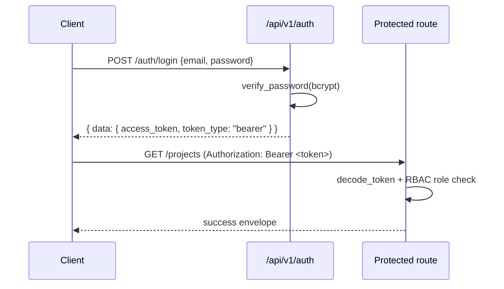

# Project Sentinel — API Reference

The backend is a **FastAPI** application. All endpoints are versioned under the prefix **`/api/v1`**. Interactive OpenAPI docs are served at `/docs` (Swagger UI) and `/redoc`.

## Response Envelopes

Every important endpoint returns the same explainable shape, built by `backend/app/core/response.py`.

### Success envelope

```json
{
  "status": "success",
  "data": { },
  "explanation": {
    "summary": "…",
    "reasoning": ["…"],
    "evidence": [{ "source": "…", "detail": "…", "value": null }],
    "rules_triggered": ["…"],
    "calculations": [{ "name": "…", "formula": "…", "inputs": {}, "result": null }],
    "confidence": 1.0
  },
  "audit_id": "aud_…",
  "next_actions": [
    { "action": "…", "reason": "…", "priority": "high", "module": "risks" }
  ]
}
```

### Error envelope

```json
{
  "status": "error",
  "error_code": "VALIDATION_ERROR",
  "message": "Human-readable message",
  "details": { },
  "suggested_action": "What the caller should do next"
}
```

The `next_actions` array is composed of `{ action, reason, priority, module }` objects so the UI can surface "what to do next" directly from any response.

## Authentication Flow

Auth is JWT (HS256) + RBAC. Passwords are hashed with bcrypt/passlib.



1. `POST /api/v1/auth/login` with credentials → returns a signed JWT access token (default lifetime 12h).
2. Send `Authorization: Bearer <token>` on every subsequent request.
3. A FastAPI dependency decodes the token and enforces the caller's RBAC role (Admin / ProjectManager / TeamLead / Contributor / Viewer). See [SECURITY.md](./SECURITY.md) for the full role/permission matrix.

## Route Groups

All groups are mounted under `/api/v1`.

| Group | Prefix | Responsibility |
| --- | --- | --- |
| Auth | `/auth` | Login, token issue/refresh, current user |
| Users | `/users` | User CRUD, role assignment |
| Projects | `/projects` | Project lifecycle, Project DNA |
| Intake | `/intake` | Gap collection, clarification answers |
| Documents | `/documents` | Upload, list, retrieve documents |
| RAG | `/rag` | Semantic search over project documents with citations |
| Agents | `/agents` | Invoke agents / run the planning workflow |
| WBS | `/wbs` | Work breakdown structure items |
| Resources | `/resources` | Members, skills, allocations, utilisation |
| Dependencies | `/dependencies` | DAG build & analysis (React Flow export) |
| Timeline | `/timeline` | CPM/PERT schedule, critical path, Gantt |
| Risks | `/risks` | Rule-based risk evaluation |
| Recovery | `/recovery` | Rescue / recovery plans |
| Reports | `/reports` | Generated reports |
| Health | `/health` | Project health score (11 dimensions) |
| Simulations | `/simulations` | Digital-twin what-if scenarios |
| Portfolio | `/portfolio` | Cross-project portfolio review |
| Knowledge Graph | `/knowledge-graph` | Project DNA knowledge nodes/edges |
| Lessons Learned | `/lessons-learned` | Retrospective knowledge capture |
| Methodology | `/methodology` | Methodology recommendation + PMBOK mapping |
| Audit | `/audit` | Audit log query |
| Admin | `/admin` | Settings, system administration |

## Example Requests & Responses

### Auth — login

```http
POST /api/v1/auth/login
Content-Type: application/json

{ "email": "pm@sentinel.dev", "password": "••••••••" }
```

```json
{
  "status": "success",
  "data": { "access_token": "eyJhbGci…", "token_type": "bearer", "role": "ProjectManager" },
  "explanation": { "summary": "Authenticated pm@sentinel.dev", "confidence": 1.0 },
  "audit_id": "aud_login_8f21",
  "next_actions": [
    { "action": "Open project", "reason": "Resume planning", "priority": "normal", "module": "projects" }
  ]
}
```

### Timeline — compute schedule (CPM/PERT)

```http
POST /api/v1/timeline/{project_id}/schedule
Authorization: Bearer <token>
```

```json
{
  "status": "success",
  "data": {
    "project_duration": 14.0,
    "project_std_dev": 1.915,
    "critical_path": ["A", "B", "D"],
    "deadline": 12,
    "deadline_feasible": false,
    "schedule_pressure": 1.167,
    "gantt": [{ "task_id": "A", "label": "Design", "start": 0.0, "end": 4.0, "critical": true }]
  },
  "explanation": {
    "summary": "Computed schedule via CPM. Project duration = 14.0 days; critical path has 3 task(s).",
    "reasoning": [
      "Task durations estimated with PERT: (O + 4M + P) / 6.",
      "Forward pass computed earliest start/finish; backward pass computed latest start/finish; float = LS - ES.",
      "Critical path = chain of zero-float tasks; it sets the project duration."
    ],
    "rules_triggered": ["SCHEDULE_INFEASIBLE"],
    "calculations": [
      { "name": "project_duration", "formula": "max(EF over all tasks)", "inputs": { "tasks": 4 }, "result": 14.0 },
      { "name": "schedule_pressure", "formula": "project_duration / deadline", "inputs": { "project_duration": 14.0, "deadline": 12 }, "result": 1.167 }
    ],
    "confidence": 1.0
  },
  "audit_id": "aud_sched_1a2b",
  "next_actions": [
    { "action": "Reduce scope or extend deadline", "reason": "Deadline infeasible", "priority": "high", "module": "recovery" }
  ]
}
```

### Risks — evaluate

```http
POST /api/v1/risks/{project_id}/evaluate
Authorization: Bearer <token>
```

```json
{
  "status": "success",
  "data": {
    "risks": [
      {
        "rule_id": "RISK_TESTING_WINDOW_MINIMUM",
        "title": "Insufficient Testing Window",
        "category": "testing_delay",
        "severity": "high",
        "probability": 4,
        "impact": 4,
        "score": 64.0,
        "evidence": [{ "metric": "testing_window_days", "operator": "<", "threshold": 3, "observed": 2 }],
        "recommended_action": "Front-load test planning and begin testing earlier in parallel."
      }
    ]
  },
  "explanation": {
    "summary": "Risk 'Insufficient Testing Window' triggered (high).",
    "rules_triggered": ["RISK_TESTING_WINDOW_MINIMUM"],
    "calculations": [
      { "name": "risk_score", "formula": "(probability * impact) / 25 * 100", "inputs": { "probability": 4, "impact": 4 }, "result": 64.0 }
    ],
    "confidence": 1.0
  },
  "audit_id": "aud_risk_77c0",
  "next_actions": []
}
```

### RAG — semantic search

```http
POST /api/v1/rag/{project_id}/search
Authorization: Bearer <token>

{ "query": "What is the project deadline?" }
```

```json
{
  "status": "success",
  "data": {
    "answer": "The delivery deadline is 30 June 2026.",
    "citations": [
      { "document": "charter.pdf", "page": 2, "section": "Timeline", "chunk_id": "c_014", "snippet": "…delivery by 30 June 2026…" }
    ]
  },
  "explanation": { "summary": "Answered from 1 cited source.", "confidence": 0.82 },
  "audit_id": "aud_rag_5521",
  "next_actions": []
}
```

If no supporting chunk is found, RAG never fabricates a citation; it returns *"No supporting source was found in the uploaded documents."* See [RAG.md](./RAG.md).

## Error Codes (representative)

| `error_code` | Meaning |
| --- | --- |
| `AUTH_INVALID_CREDENTIALS` | Login failed |
| `AUTH_TOKEN_EXPIRED` | JWT expired or invalid |
| `FORBIDDEN` | Caller's role lacks permission |
| `VALIDATION_ERROR` | Pydantic request validation failed |
| `NOT_FOUND` | Resource does not exist |
| `UPLOAD_REJECTED` | File failed type/size/path validation |
| `DEPENDENCY_CYCLE` | Dependency graph contains a cycle; cannot schedule |
| `RATE_LIMITED` | Per-minute rate limit exceeded |
