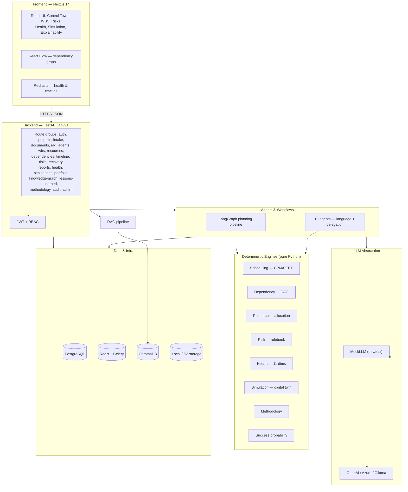

# Project Sentinel — Architecture

**Project Sentinel** is an explainable, agentic AI project co-ordinator. It plans, monitors, and de-risks projects the way a senior programme manager would — but every recommendation it makes is fully traceable back to the rule or formula that produced it.

## Core Philosophy

Sentinel is built on one uncompromising principle:

> **AI assists human decisions. Deterministic algorithms do anything computable. LLMs are used only for language.**

- **Deterministic-first.** Scheduling, risk, resource allocation, health scoring, simulation, and success probability are computed by pure-Python engines — not guessed by a model. Given the same inputs, they always return the same output.
- **LLMs for language only.** Large language models are used strictly for language tasks: document understanding, summarisation, generating clarification questions, and drafting reports. They never decide a number that an algorithm can compute.
- **Explainability is mandatory.** Every recommendation carries a structured `Explanation` (summary, reasoning, evidence, rules_triggered, calculations, assumptions, alternatives, confidence, agent, timestamp). No output is a black box.
- **Human-in-the-loop.** Major changes require human approval. Sentinel recommends; people decide.
- **Full audit logging.** Every agent run and every material change is recorded for later inspection.

## Technology Stack

| Layer | Technology |
| --- | --- |
| Frontend | Next.js 14 (App Router), React, TypeScript, Tailwind CSS, TanStack Query, Zustand, Zod, Recharts, React Flow |
| Backend | FastAPI, Python 3.11, Pydantic, SQLAlchemy, Alembic |
| Database | PostgreSQL |
| Cache / queue | Redis + Celery |
| Vector store | ChromaDB (per-project namespaces) |
| Agent orchestration | LangGraph |
| LLM | Provider abstraction — OpenAI-compatible, Azure OpenAI-ready, Ollama-ready, plus a deterministic `MockLLM` for dev/test |
| Auth | JWT (HS256) + RBAC |
| Storage | Local filesystem + S3-compatible abstraction |
| Testing | Pytest, Playwright, React Testing Library |
| DevOps | Docker, Docker Compose, GitHub Actions |

## System Structure

The backend is organised so that **computation lives in engines**, **language and orchestration live in agents/workflows**, and **transport lives in the API layer**:

```
backend/app/
  engines/     # pure-Python deterministic engines (each returns an Explanation)
  agents/      # agent definitions (language + orchestration of engines)
  workflows/   # LangGraph pipelines wiring agents together
  llm/         # LLM provider abstraction (mock | openai | azure | ollama)
  rag/         # upload -> chunk -> embed -> ChromaDB -> cited retrieval
  models/      # SQLAlchemy ORM models
  schemas/     # Pydantic request/response schemas
  api/routers/ # FastAPI route groups under /api/v1
  core/        # response envelope, security (JWT + bcrypt)
  seed/        # deterministic seed data
```

## Container / Component Diagram



## Data-Flow Diagram (planning pipeline)


## The Explainability Principle

Every deterministic engine and every agent produces a shared `Explanation` object (defined in `backend/app/engines/explain.py`). It is pure Python with no framework dependencies so it can be unit-tested and embedded anywhere — inside engines, agents, and API responses.

An `Explanation` answers, for any output:

- **What** was recommended or computed? (`summary`)
- **Why?** (`reasoning` — an ordered chain)
- **What backs it?** (`evidence` — traceable facts: a document page, a task id, a rule id)
- **Which rules / formulas fired?** (`rules_triggered`)
- **What was calculated?** (`calculations` — each with name, formula, inputs, result)
- **How sure are we, and on what assumptions?** (`confidence` 0..1, `assumptions`, `alternatives`)
- **Who produced it and when?** (`agent`, `timestamp`)

Deterministic engines carry high confidence (0.9–1.0) because outputs are computed, not guessed. LLM-assisted outputs carry lower confidence and **must** cite evidence. This is what lets a reviewer — or a hackathon judge — ask *"why?"* about any number on the screen and get an exact, reproducible answer. See [JUDGE_EXPLAINABILITY.md](./JUDGE_EXPLAINABILITY.md) for a full end-to-end walkthrough.

## API Response Envelope

Every important endpoint returns the same explainable shape (built in `backend/app/core/response.py`):

```json
{
  "status": "success",
  "data": { },
  "explanation": {
    "summary": "",
    "reasoning": [],
    "evidence": [],
    "rules_triggered": [],
    "calculations": [],
    "confidence": 1.0
  },
  "audit_id": "…",
  "next_actions": []
}
```

Errors return a parallel shape: `{ status: "error", error_code, message, details, suggested_action }`. See [API.md](./API.md).
