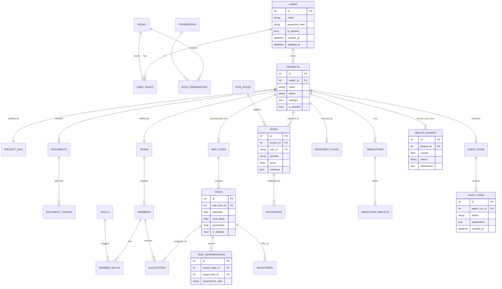

# Project Sentinel — Database

The persistence layer uses **SQLAlchemy** ORM models with **Alembic** migrations, targeting **PostgreSQL** in production (SQLite for zero-infra local dev and tests). The declarative `Base`, engine, and session factory live in `backend/app/database.py`; models live in `backend/app/models/`.

## Conventions

Every table follows the same conventions:

- **Primary keys** — surrogate `id` on every table.
- **Foreign keys** — explicit FKs with **indexes** on every FK column.
- **Timestamps** — `created_at` and `updated_at` on every table.
- **Soft delete** — `is_deleted` flag rather than physical deletion, preserving audit history.
- **Flexible payloads** — `JSON` columns for semi-structured data (e.g. an agent's `Explanation`, agent I/O, settings).
- **Parameterised queries** — all access goes through the ORM; no raw SQL, so queries are parameterised by construction.

## Tables

Grouped by domain:

**Identity & access**
`users`, `roles`, `permissions`, `user_roles`

**Projects & profiling**
`projects`, `project_dna`, `project_methods`, `project_templates`

**Documents & RAG**
`documents`, `document_chunks`, `document_sources`

**Team & capacity**
`teams`, `members`, `skills`, `member_skills`, `availability`

**Planning**
`wbs_items`, `tasks`, `task_dependencies`, `allocations`, `milestones`

**Risk & recovery**
`risks`, `risk_rules`, `mitigations`, `recovery_plans`

**Reporting & meetings**
`reports`, `meeting_minutes`, `action_items`

**Simulation & health**
`simulations`, `simulation_results`, `health_scores`

**Portfolio & knowledge**
`portfolio_projects`, `knowledge_nodes`, `knowledge_edges`, `lessons_learned`

**Conversation & audit**
`conversations`, `agent_runs`, `activity_logs`, `audit_logs`, `settings`

## Key Relationships

- A **user** has many **roles** (via `user_roles`); a **role** has many **permissions** (RBAC — see [SECURITY.md](./SECURITY.md)).
- A **project** has exactly one **project_dna** profile and one selected method (`project_methods`), many **documents**, one **team**, and many **wbs_items** / **tasks**.
- A **document** has many **document_chunks** (embedded into ChromaDB) and **document_sources** used for citations.
- A **team** has many **members**; a **member** has many **skills** (via `member_skills`) and **availability** records.
- A **task** rolls up to a **wbs_item**, is linked to other tasks through **task_dependencies** (the DAG edges), is assigned via **allocations**, and rolls up to **milestones**.
- A **risk** references the **risk_rule** that triggered it and can have many **mitigations**; severe conditions produce **recovery_plans**.
- A **simulation** produces **simulation_results** (before/after snapshots); the Health engine writes **health_scores** over time.
- **knowledge_nodes** / **knowledge_edges** form the Project DNA knowledge graph; **lessons_learned** capture retrospectives.
- Every agent execution writes an **agent_run**; every material change writes an **audit_log**; **activity_logs** capture lighter-weight events.

## Entity-Relationship Diagram (core tables)

> The ERD shows the core planning, risk, and audit tables. `role_permissions` is the association table linking `roles` and `permissions`; the remaining tables (portfolio, knowledge graph, lessons learned, meeting minutes, conversations) follow the same conventions and attach to `projects`.

## Migrations & Seeding

- **Alembic** manages schema evolution: `alembic upgrade head` applies migrations; `alembic revision --autogenerate` creates a new one after model changes.
- The **seed** module (`app.seed.seed`) loads deterministic demo data — users, roles/permissions, a sample project with team, skills, documents, WBS, dependencies, and the risk rulebook — so the app is immediately demonstrable.
- For tests and quick local bootstrap, `init_db()` creates all tables directly from ORM metadata.
