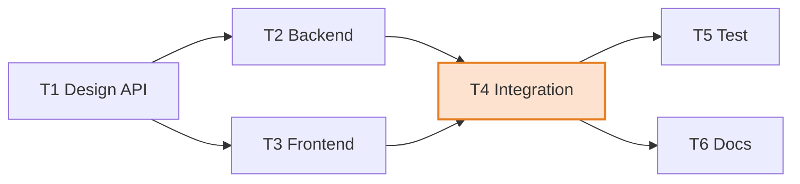

# Dependency Engine — DAG Construction & Analysis

**File:** `backend/app/engines/dependency.py`

The Dependency Engine builds and analyses the task **dependency graph**. It is pure standard-library Python — no third-party graph package — so its behaviour is transparent and fully testable. It validates that the graph is a **DAG**, produces an execution order, and surfaces structural fragilities (bottlenecks, single points of failure). Every result carries an `Explanation`.

Edge semantics: an edge `source → target` means **source must finish before target can start** (finish-to-start).

## Responsibilities

- Build a directed graph of task dependencies.
- Validate it is a **DAG** (detect cycles, with the cycle path).
- Produce a **topological sort** (a valid execution order).
- Detect **bottlenecks** (nodes that concentrate dependencies).
- Detect **single points of failure** (SPOF).
- Export **nodes and edges** for visualisation (React Flow compatible).

## Cycle Detection (DFS, three-colour)

A depth-first search colours nodes WHITE (unseen) → GRAY (on the current stack) → BLACK (done). Encountering a GRAY node on an out-edge means a **back edge** — a cycle — and the engine reconstructs the exact cycle path by walking parent pointers.

```
if any successor v is GRAY:  cycle found; rebuild path v … u … v
```

When a cycle exists, the engine triggers `DEP_CYCLE_DETECTED`, records the cycle path as evidence, and returns an **empty** topological order (the plan cannot be scheduled until the cycle is broken). The [Scheduling Engine](./SCHEDULING_ENGINE.md) refuses to run on a cyclic graph, so this check is a hard gate in the pipeline.

## Topological Sort (Kahn's algorithm)

For an acyclic graph, execution order is produced with **Kahn's algorithm**, made deterministic by always processing the ready set (in-degree 0) in sorted order:

```
in_degree[v] = number of predecessors of v
ready = sorted( nodes with in_degree 0 )
repeat: pop smallest ready node → append to order → decrement successors' in-degree
        → any that reach 0 join ready (re-sorted)
```

## Bottleneck Detection

A node is a **bottleneck** when its combined fan-in and fan-out is high:

```
bottleneck_score = fan_in + fan_out
node is a bottleneck  <=>  bottleneck_score >= bottleneck_threshold * 2   (default threshold 2, i.e. score >= 4)
```

Bottlenecks are returned sorted by score (highest first) with their `fan_in`, `fan_out`, and `bottleneck_score`. High-fan nodes are where delays fan out across the plan.

## Single Point of Failure Detection

A task is a **SPOF** when it is the **sole predecessor of two or more downstream tasks**:

```
task T is a SPOF  <=>  at least 2 of T's successors have exactly one predecessor (T itself)
```

If T slips, every one of those downstream tasks slips with no fallback path. SPOF tasks feed the Resource engine's backup-owner logic and the Risk engine's `RISK_SINGLE_POINT_OF_FAILURE` rule (`spof_count > 0`).

## Example Graph

Consider six tasks. `T1 → T2`, `T1 → T3`, `T2 → T4`, `T3 → T4`, `T4 → T5`, `T4 → T6`.



Analysis of this graph:

- **Valid DAG** — no cycles; a topological order exists, e.g. `T1, T2, T3, T4, T5, T6`.
- **Bottleneck:** `T4` has fan_in 2 + fan_out 2 = score **4** (≥ 4) → flagged. `T1` has fan_in 0 + fan_out 2 = 2 (not flagged at the default threshold).
- **SPOF:** `T4` is the *only* predecessor of both `T5` and `T6` → `T4` is a single point of failure. Any slip in Integration cascades into both Test and Docs.

### A cyclic counter-example

If someone adds `T6 → T1`, the graph gains a cycle `T1 → T2 → T4 → T6 → T1`. The engine returns `has_cycle = true`, `cycle_path = [T1, T2, T4, T6, T1]`, an empty topological order, and triggers `DEP_CYCLE_DETECTED` — scheduling is blocked until a human breaks the loop.

## Output

`build(...)` returns a `DependencyGraphResult` whose `to_dict()` includes:

- `nodes[]` — `{ id, label, successors, predecessors }`.
- `edges[]` — `{ source, target, dependency_type, reason }` (React Flow compatible).
- `cycle` — `{ has_cycle, cycle_path }`.
- `topological_order[]` — empty if a cycle exists.
- `bottlenecks[]` — `{ task_id, label, fan_in, fan_out, bottleneck_score }`.
- `single_points_of_failure[]` — task ids.
- `explanation` — graph size calculation and triggers for cycle / bottleneck / SPOF findings.
