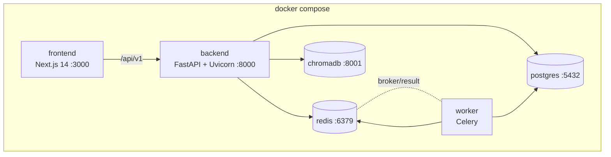
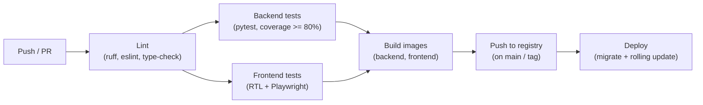

# Project Sentinel — Deployment

Sentinel is containerised with **Docker** and orchestrated locally with **Docker Compose**. CI/CD runs on **GitHub Actions**. This document covers the Compose service topology, environment configuration, production notes, scaling, and the CI/CD pipeline.

## Service Topology (Docker Compose)



| Service | Image / build | Purpose | Port |
| --- | --- | --- | --- |
| `frontend` | Next.js 14 build | React UI (App Router) | 3000 |
| `backend` | FastAPI + Uvicorn | API `/api/v1`, engines, agents, RAG | 8000 |
| `worker` | Same image as backend | Celery worker for async/long tasks | — |
| `postgres` | PostgreSQL | Primary datastore | 5432 |
| `redis` | Redis | Cache + Celery broker/result backend | 6379 |
| `chromadb` | ChromaDB | Vector store for RAG | 8001 |

Bring the stack up and seed:

```bash
docker compose up --build
docker compose exec backend python -m app.seed.seed
docker compose exec backend alembic upgrade head   # apply migrations
```

## Environment Configuration

Compose injects production-appropriate env vars, notably overriding the SQLite default with the PostgreSQL service URL. See the full table in [SETUP.md](./SETUP.md). Key production overrides:

```env
ENVIRONMENT=production
DEBUG=false
SECRET_KEY=<strong-32B-secret>
DATABASE_URL=postgresql+psycopg://sentinel:<pw>@postgres:5432/sentinel
REDIS_URL=redis://redis:6379/0
CHROMA_HOST=chromadb
CHROMA_PORT=8001
LLM_PROVIDER=openai            # or azure | ollama | mock
OPENAI_API_KEY=<key>
STORAGE_BACKEND=s3
S3_BUCKET=<bucket>
S3_ENDPOINT_URL=<endpoint>
CORS_ORIGINS=https://app.example.com
```

## Production Notes

- **Run behind a reverse proxy** (nginx / Traefik / cloud LB) terminating TLS; forward to the backend and frontend services.
- **Backend process model:** run Uvicorn workers behind Gunicorn (or multiple Uvicorn workers) sized to CPU. FastAPI is async; engines are CPU-bound pure Python, so scale workers with cores.
- **Migrations:** run `alembic upgrade head` as a release step before rolling new backend containers.
- **Persistence:** mount volumes for PostgreSQL data, ChromaDB persistence, and local file storage (or switch `STORAGE_BACKEND=s3`).
- **Secrets:** inject via the platform's secrets manager as env vars — never bake into images.
- **Health checks:** expose and wire liveness/readiness probes for `backend` and dependencies.
- **LLM provider:** `mock` needs no external calls (ideal for demos/CI); switch to `openai`/`azure`/`ollama` in production. The provider abstraction means no code changes — only env vars.

## Scaling

| Component | Strategy |
| --- | --- |
| `backend` | Stateless — scale horizontally behind the load balancer; add Uvicorn/Gunicorn workers per replica. |
| `worker` | Scale Celery workers/replicas for document processing, embedding, and long agent runs. |
| `postgres` | Vertical scale + read replicas; connection pooling (`pool_pre_ping` is on). |
| `redis` | Cluster/replica for HA; separate cache and broker DBs if needed. |
| `chromadb` | Persistent volume; scale the vector service independently; per-project namespaces keep queries scoped. |
| `frontend` | Static/SSR — scale replicas or serve via a CDN/edge. |

Because the deterministic engines are pure functions with no shared state, backend replicas need no coordination — the same inputs yield the same outputs on any node.

## CI/CD (GitHub Actions)

Workflows live in `.github/workflows/`. A representative pipeline:



1. **Lint & type-check** — Python (ruff) and TypeScript/ESLint.
2. **Test** — backend `pytest` with the 80%+ coverage gate; frontend React Testing Library and Playwright end-to-end. See [TESTING.md](./TESTING.md).
3. **Build** — Docker images for backend and frontend.
4. **Publish** — push tagged images to the container registry on `main`/release tags.
5. **Deploy** — run Alembic migrations, then a rolling update of the backend and frontend services.

CI runs with `LLM_PROVIDER=mock` so tests are deterministic, fast, and require no external API keys.
