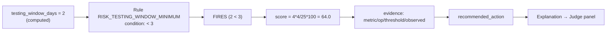

# Judge Explainability — Proving There Is No Hallucination

This is Sentinel's flagship feature. Point at **any** number, risk, or recommendation on the screen and ask *"why?"* — Sentinel replays the exact rule, evidence, and calculation that produced it. Nothing is a black box, and nothing is invented by a language model.

The **Judge Explainability agent** does not compute anything itself. It surfaces the `Explanation` object that the deterministic engine (or cited RAG retrieval) already attached to the output. Because engines are pure functions, the trace is reproducible: same inputs → same explanation, every time.

## Why This Convinces a Skeptic

Two independent guarantees remove hallucination from the equation:

1. **Computable things are computed, not generated.** Schedules, risks, health, allocation, and success probability come from pure-Python engines. An LLM never decides a number.
2. **Language things are grounded and cited.** When the LLM is used (summaries, answers, reports), the underlying facts come from the engines or from RAG retrieval with real citations — and if RAG finds no source, it says *"No supporting source was found in the uploaded documents."* rather than guessing.

Every `Explanation` carries: `summary`, `reasoning[]`, `evidence[]`, `rules_triggered[]`, `calculations[]` (name, formula, inputs, result), `assumptions[]`, `alternatives[]`, `confidence`, `agent`, and `timestamp`.

## End-to-End Walkthrough: "Why is testing at risk?"

A judge clicks the **Insufficient Testing Window** risk and asks *why*. Here is the complete trace Sentinel returns.

### Step 1 — The metric was computed deterministically

The Scheduling and intake data establish that testing can only begin two days before the hard deadline:

```
testing_window_days = 2      # computed from the testing task's earliest start vs. the deadline
```

This is a number the scheduling engine derives — not a model's opinion.

### Step 2 — A rule fired on that metric

The Risk engine loads `risk_rules.yaml` and evaluates `RISK_TESTING_WINDOW_MINIMUM`:

```yaml
- rule_id: RISK_TESTING_WINDOW_MINIMUM
  name: Insufficient Testing Window
  category: testing_delay
  condition: {metric: testing_window_days, op: "<", value: null}
  threshold: 3
  severity: high
  rationale: >
    A testing window under 3 days leaves no room to find and fix defects before
    delivery. Integration and UAT are the most common late-stage failure points.
  recommended_action: Front-load test planning and begin testing earlier in parallel.
```

Condition check: `testing_window_days (2) < threshold (3)` → **TRUE** → the rule fires.

### Step 3 — The score is a transparent calculation

Severity `high` maps to probability 4 and impact 4:

```
risk_score = (probability × impact) / 25 × 100
           = (4 × 4) / 25 × 100
           = 64.0
```

### Step 4 — The evidence points at the exact trigger

```json
{
  "metric": "testing_window_days",
  "operator": "<",
  "threshold": 3,
  "observed": 2
}
```

### Step 5 — The full Explanation returned to the judge

```json
{
  "summary": "Risk 'Insufficient Testing Window' triggered (high).",
  "reasoning": [
    "A testing window under 3 days leaves no room to find and fix defects before delivery. Integration and UAT are the most common late-stage failure points.",
    "Rule condition: testing_window_days < 3. Observed testing_window_days = 2."
  ],
  "evidence": [
    { "source": "rule:RISK_TESTING_WINDOW_MINIMUM", "detail": "testing_window_days < 3 (observed 2)", "value": 2 }
  ],
  "rules_triggered": ["RISK_TESTING_WINDOW_MINIMUM"],
  "calculations": [
    { "name": "risk_score", "formula": "(probability * impact) / 25 * 100", "inputs": { "probability": 4, "impact": 4 }, "result": 64.0 }
  ],
  "confidence": 1.0,
  "agent": "risk-engine",
  "timestamp": "2026-…"
}
```

### Step 6 — The recommendation is actionable and traceable

```
recommended_action: "Front-load test planning and begin testing earlier in parallel."
```

The judge can now see the **complete chain**: a computed metric (`testing_window_days = 2`) → a named rule (`RISK_TESTING_WINDOW_MINIMUM`) → an explicit condition (`< 3`) → a reproducible score (`64.0`) → cited evidence → a concrete action. There is no step where a language model "decided" testing was risky. Change the input to `testing_window_days = 5` and the rule does not fire — the trace is a pure function of the data.



## The Same Trace, Everywhere

The mechanism is identical across the product because every engine emits an `Explanation`:

- **"Why is the deadline infeasible?"** → Scheduling engine: `project_duration = 14 > deadline 12`, `schedule_pressure = 1.167`, `SCHEDULE_INFEASIBLE`, with per-task critical-path evidence and the `project_duration` / `schedule_pressure` calculations.
- **"Why is health Red?"** → Health engine: the 11 `score × weight` contributions, the `overall_health` sum, and the three lowest-contributing dimensions named as drivers.
- **"Why did Priya get this task?"** → Resource engine: `skill_match = coverage×0.7 + expertise/5×0.3`, the ranked candidates, her remaining capacity, and the recorded backup owner.
- **"Why is there a cycle?"** → Dependency engine: `DEP_CYCLE_DETECTED` with the exact `cycle_path`.
- **"What happens if we lose a week?"** → Simulation engine: before/after schedule and health from the *same* engines, with `duration_delta` and `health_delta` calculations.
- **"What's our success probability?"** → Success calculator: the six weighted factors summing to the percentage, with the weakest factors driving improvement actions.
- **"Where did this fact come from?"** → RAG: a citation with document, page, section, chunk id, and snippet — or an explicit "no source found".

## Example Judge Questions to Try

- *"Why is testing at risk?"* (the walkthrough above)
- *"Why is this the critical path?"*
- *"Why is the deadline infeasible?"*
- *"Why did the health score drop to Red?"*
- *"Why was this member assigned, and who's the backup?"*
- *"Why is there a single point of failure here?"*
- *"What happens to the timeline if the API task slips 3 days?"*
- *"Why is our success probability 58%?"*
- *"Which document says the deadline is 30 June?"*
- *"Show me every rule that fired on this project, and the metric behind each."*

In every case the answer is a replayable `Explanation`, not prose a model made up. That is the whole point of Project Sentinel.
