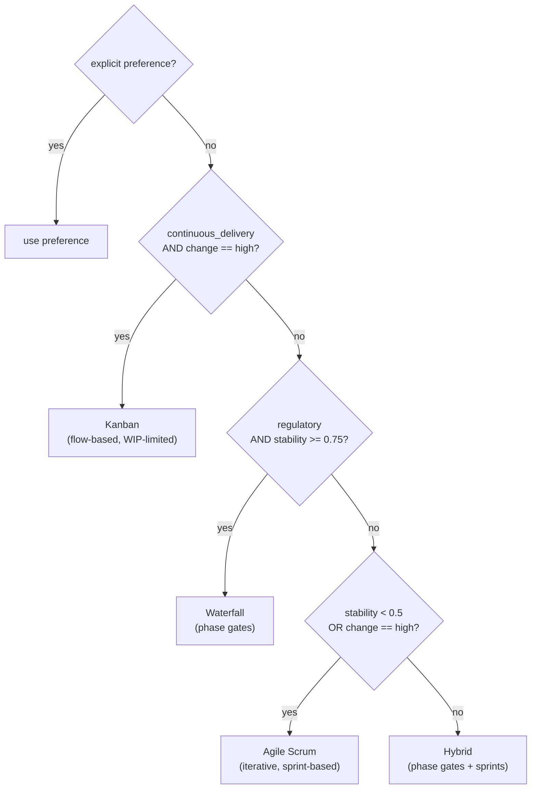

# Methodology Engine

**File:** `backend/app/engines/methodology.py`

The Methodology Engine recommends a delivery methodology — **Waterfall**, **Agile/Scrum**, **Kanban**, or **Hybrid** — from a deterministic set of decision rules over the project's profile, and returns the matching **ceremonies**, **artefacts**, and **reporting style**. It also maps the project to **PMBOK** process groups and knowledge areas so a PMO can trace governance. The result carries an `Explanation` (confidence 0.9, since methodology is a judgement encoded as rules).

## Project Profile Inputs

```python
profile = {
  "requirements_stability": 0.0..1.0,   # 1 = fully stable / known upfront
  "duration_days": int,
  "team_size": int,
  "change_frequency": "low" | "medium" | "high",
  "regulatory": bool,                    # heavy compliance / sign-off
  "continuous_delivery": bool,           # steady stream of small items
  "preference": "scrum"|"kanban"|"waterfall"|"hybrid"  # optional explicit override
}
```

The Project DNA agent produces this profile earlier in the pipeline.

## Decision Rules

If an explicit `preference` is supplied, it wins (and is recorded as the reason). Otherwise the engine evaluates, in order:



| Condition | Recommendation | Rationale |
| --- | --- | --- |
| `continuous_delivery` and `change == "high"` | **Kanban** | Continuous stream of small items with high change → flow-based, WIP-limited |
| `regulatory` and `requirements_stability ≥ 0.75` | **Waterfall** | Stable, heavily-regulated requirements → phase gates and sign-off |
| `requirements_stability < 0.5` or `change == "high"` | **Scrum** | Evolving requirements / frequent change → iterative sprints |
| otherwise | **Hybrid** | Mixed stability with some fixed milestones → phase gates + sprint execution |

## Methodology Profiles

| Methodology | Ceremonies | Artefacts | Reporting style |
| --- | --- | --- | --- |
| **Scrum** | Sprint Planning, Daily Stand-up, Sprint Review, Retrospective | Product Backlog, Sprint Backlog, Increment, Burndown Chart | Sprint review + burndown, fortnightly |
| **Kanban** | Daily Stand-up, Replenishment, Delivery Planning | Kanban Board, WIP Limits, Cumulative Flow Diagram | Flow metrics (cycle time, throughput), continuous |
| **Waterfall** | Phase Gate Reviews, Change Control Board | Requirements Spec, Gantt Chart, Test Plan, Sign-off | Phase-gate status, milestone-based |
| **Hybrid** | Phase Gates, Sprint Planning, Daily Stand-up, Review | Milestone Plan, Sprint Backlog, Risk Register, Burndown | Milestone gate + sprint cadence |

## PMBOK Mapping

Every recommendation is mapped to the full PMBOK framework so governance is traceable:

**5 Process Groups:** initiating, planning, executing, monitoring & controlling, closing.

**10 Knowledge Areas:** integration, scope, schedule, cost, quality, resource, communication, risk, procurement, stakeholder.

## Output

`recommend(profile)` returns a `MethodologyResult` whose `to_dict()` includes:

- `recommended` — `scrum` / `kanban` / `waterfall` / `hybrid`.
- `ceremonies[]`, `artefacts[]`, `reporting_style`.
- `pmbok_process_groups[]`, `pmbok_knowledge_areas[]`.
- `explanation` — the decision reason(s) and the decision inputs as evidence.

The chosen methodology shapes the reporting cadence used by the Reporting and Executive Copilot agents downstream.
