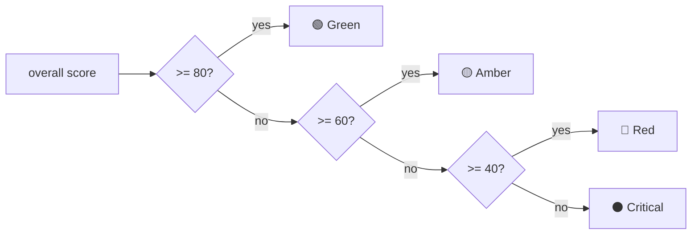

# Project Health Engine

**File:** `backend/app/engines/health.py`

Project health is a single **0..100** score that is a **weighted sum of 11 independently-scored dimensions**. Each dimension is computed from deterministic project metrics, scored 0..100, and contributes `score × weight` to the total. This is transparent scoring: every dimension exposes its inputs, its sub-score, and its contribution — nothing is hidden. The result carries an `Explanation` and can trip **rescue mode**.

## The 11 Dimensions & Weights

The weights sum to **1.0**.

| # | Dimension | Weight | Driven by (metric) |
| --- | --- | ---: | --- |
| 1 | `schedule` | **0.18** | `schedule_pressure` |
| 2 | `workload` | **0.12** | `max_utilisation` |
| 3 | `resource` | **0.10** | `overloaded_members` / `team_size` |
| 4 | `risk` | **0.15** | `open_risk_score` (worst open risk, 0..100) |
| 5 | `dependency` | **0.08** | `spof_count`, `dependency_density` |
| 6 | `requirement_clarity` | **0.10** | `requirement_completeness` (0..1) |
| 7 | `delivery_readiness` | **0.09** | `delivery_readiness` (0..1) |
| 8 | `testing_readiness` | **0.08** | `testing_window_days` |
| 9 | `stakeholder_alignment` | **0.04** | `stakeholder_alignment` (0..1) |
| 10 | `documentation` | **0.03** | `documentation_ratio` (0..1) |
| 11 | `demo_readiness` | **0.03** | `demo_readiness` (0..1) |
| | **Total** | **1.00** | |

```
overall = Σ ( dimension.score × dimension.weight )     # each score clamped to 0..100
```

Any metric that is missing falls back to a **neutral score of 60** for that dimension, so a partially-planned project still scores sensibly.

## Dimension Scoring (how each 0..100 is derived)

- **schedule** — 100 when `schedule_pressure ≤ 0.8` (comfortable buffer); ramps down through "tight but feasible" (0.8–1.0); drops steeply once infeasible (`> 1.0`).
- **workload** — 100 when `max_utilisation ≤ 0.85`; degrades toward capacity (≤ 1.0); penalised hard when overloaded (`> 1.0`).
- **resource** — `100 − (overloaded_members / team_size) × 100`.
- **risk** — `100 − open_risk_score` (the worst open risk directly erodes health).
- **dependency** — `100 − spof_count × 15 − max(0, density − 1.0) × 20`.
- **requirement_clarity** — `requirement_completeness × 100`.
- **delivery_readiness** — `delivery_readiness × 100`.
- **testing_readiness** — `min(100, testing_window_days / 5 × 100)` (5+ days → full marks).
- **stakeholder_alignment** — `stakeholder_alignment × 100`.
- **documentation** — `documentation_ratio × 100`.
- **demo_readiness** — `demo_readiness × 100`.

## Bands

The overall score maps to a status band:

| Band | Range | Meaning |
| --- | --- | --- |
| 🟢 **Green** | 80–100 | Healthy |
| 🟡 **Amber** | 60–79 | Watch |
| 🔴 **Red** | 40–59 | Trouble |
| ⚫ **Critical** | < 40 | Severe |



## Rescue Mode

```
rescue_recommended  <=>  overall < 50   (RESCUE_THRESHOLD)
```

When health falls below **50**, the engine triggers `HEALTH_RESCUE_THRESHOLD` and recommends rescue mode. This is the branch that activates the Project Rescue sub-workflow and the Recovery agent. Note the rescue threshold (50) sits inside the **Red** band — a project can be Red without yet being in rescue, but any Critical project always is.

## Top Drivers

The engine reports the **three lowest-contributing dimensions** (`score × weight`) as `top_drivers`, e.g. `"schedule (35/100)"`. These point the team straight at what is dragging health down, and feed the Next Best Action agent.

## Output

`score(metrics)` returns a `HealthResult` whose `to_dict()` includes:

- `overall` (0..100) and `status` (`green` / `amber` / `red` / `critical`).
- `rescue_recommended` (bool).
- `dimensions[]` — per dimension: `name`, `score`, `weight`, `contribution`, `rationale`.
- `top_drivers[]` — the three weakest contributors.
- `explanation` — a per-dimension `score × weight` calculation, the `overall_health` sum, the weakest-dimension summary, and the rescue trigger when applicable.
