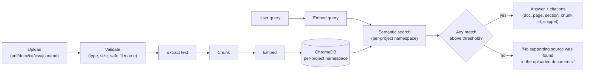

# Retrieval-Augmented Generation (RAG)

**Location:** `backend/app/rag/`

Sentinel's RAG subsystem turns uploaded project documents into a searchable, **citation-backed** knowledge base. It is the grounding layer for the Document Analysis and Executive Copilot agents. Its defining property: **it never fabricates a citation.** If retrieval finds no supporting chunk, it says so.

## Pipeline



1. **Upload** — accept a file of an allowed type (`pdf`, `docx`, `txt`, `csv`, `json`, `md`).
2. **Validate** — enforce the type allowlist, the size limit (default 25 MB), and a path-traversal-safe filename. See [SECURITY.md](./SECURITY.md).
3. **Extract text** — pull raw text from the document.
4. **Chunk** — split into retrieval-sized chunks, preserving source location (document, page, section).
5. **Embed** — vectorise each chunk with the configured embedding model.
6. **Store** — write vectors into **ChromaDB** under a **per-project namespace**, so one project can never retrieve another project's documents.
7. **Search** — embed the query and run semantic search within that project's namespace.
8. **Cite or decline** — return an answer with citations, or the explicit "no source" message.

## Citation Contract

Every retrieved fact is accompanied by a citation with enough detail to verify it by hand:

```json
{
  "document": "charter.pdf",
  "page": 2,
  "section": "Timeline",
  "chunk_id": "c_014",
  "snippet": "…delivery by 30 June 2026…"
}
```

- **Citations are traceable.** Each points at the exact document, page, section, chunk id, and a snippet of the supporting text.
- **Citations are never invented.** The engine only cites chunks that were actually retrieved from the uploaded documents.
- **No source → explicit decline.** When no chunk clears the relevance bar, RAG returns exactly:

  > *"No supporting source was found in the uploaded documents."*

This contract is what lets the Judge Explainability feature prove that a document-derived answer is grounded rather than hallucinated. An LLM may phrase the answer, but the *facts and their citations come from retrieval*, and confidence is reported accordingly (LLM-assisted answers carry sub-1.0 confidence and must cite evidence). See [JUDGE_EXPLAINABILITY.md](./JUDGE_EXPLAINABILITY.md).

## Per-Project Isolation

Each project gets its own ChromaDB namespace. Retrieval is always scoped to the active project, which:

- prevents cross-project leakage of confidential material, and
- keeps semantic search precise (only relevant corpus is considered).

## Where RAG Is Used

- **Document Analysis agent** — extracts structured project facts from documents, each backed by a citation.
- **Executive Copilot agent** — answers plain-language questions grounded in the project's documents.
- **Reporting agent** — pulls cited evidence into drafted reports.

In all cases the LLM is confined to language; the truth of any claim traces back to a retrieved, cited chunk — or the claim is not made.
