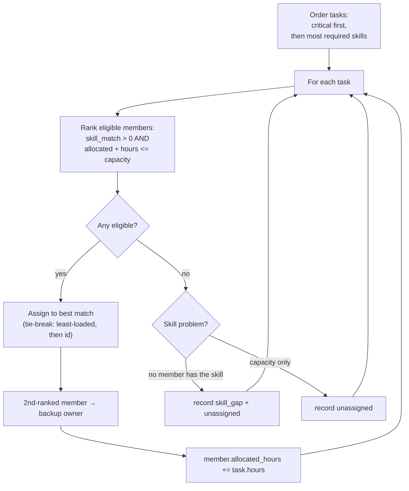

# Resource Engine — Skill-Matched Allocation

**File:** `backend/app/engines/resource.py`

The Resource Engine performs **deterministic, explainable, skill-matched allocation**. It assigns tasks to team members by skill fit and expertise, respects each member's capacity, computes utilisation, and flags overload, unassigned work, skill gaps, and backup owners. Every assignment records *why* it was made, and the whole run carries an `Explanation`.

## Inputs

```python
tasks   = [{"id", "label", "required_skills": [...], "hours": 8, "critical": bool}]
members = [{"id", "name", "skills": {skill: level_1_to_5}, "capacity_hours": 40, "role"}]
```

## Skill-Match Formula

For a task's required skills against a member's skill map:

```
covered   = required skills the member actually has
coverage  = len(covered) / len(required)                 # breadth of fit
avg_level = mean(expertise level of covered skills)       # depth of fit, 1..5

skill_match = coverage * 0.7  +  (avg_level / 5) * 0.3
```

- **Coverage is weighted 70%** — having the right skills at all matters most.
- **Expertise is weighted 30%**, normalised to the 1..5 scale.
- If a member covers **none** of the required skills, `skill_match = 0` (they are ineligible).
- If a task lists **no** required skills, it gets a neutral fit of `0.5` (skill-agnostic work).

**Example:** a task requires `["python", "fastapi"]`. A member has `{python: 5, fastapi: 3, react: 4}`.

```
coverage  = 2/2 = 1.0
avg_level = (5 + 3) / 2 = 4.0
skill_match = 1.0 * 0.7 + (4.0 / 5) * 0.3 = 0.70 + 0.24 = 0.94  → 94%
```

## Allocation Algorithm

A **greedy, capacity-aware** assignment that processes the most important work first:



1. **Order tasks deterministically** — critical tasks first, then by descending count of required skills.
2. **Rank members** for each task: only those with `skill_match > 0` *and* enough remaining capacity (`allocated_hours + task.hours <= capacity_hours`) are eligible. Ranking is by match descending, then least-loaded first, then id — fully deterministic.
3. **Assign** the task to the best-ranked member and add the hours to their load. The **second-ranked** eligible member is recorded as the **backup owner** for resilience.
4. **Handle the no-fit case:** if no member is eligible, the task is **unassigned**. The engine distinguishes a *skill gap* (no member on the team has a required skill) from a *capacity problem*, recording skill gaps explicitly.

## Utilisation and Overload

```
utilisation(member) = allocated_hours / capacity_hours
member is overloaded  <=>  utilisation > 1.0
```

Utilisation is reported per member. Any overloaded member is flagged and the `RESOURCE_OVERLOAD` marker is triggered in the explanation (and downstream the Risk engine's `RISK_RESOURCE_OVERLOAD` rule fires on `max_utilisation > 1.0`).

Because the algorithm refuses to assign a task that would exceed capacity, overload is normally surfaced as *unassigned* work plus a capacity warning rather than silent over-allocation.

## Single Points of Failure & Backups

For every assigned task, the engine records a **backup owner** (the next-best eligible member) where one exists. This directly supports the Dependency engine's SPOF analysis and the risk mitigation of *"assign a backup owner"*.

## Output

`allocate(...)` returns an `AllocationResult` whose `to_dict()` includes:

- `assignments[]` — per task: `member_id/name`, `skill_match`, `hours`, a human `reason`, and `backup_member_id`.
- `utilisation` — per-member ratio.
- `overloaded_members[]`, `unassigned_tasks[]`, `skill_gaps[]`.
- `explanation` — the greedy strategy, the `utilisation` calculation with inputs, and triggers for `RESOURCE_OVERLOAD` / `SKILL_GAP` when relevant.

Every field is computed; the LLM is never involved in who gets which task.
