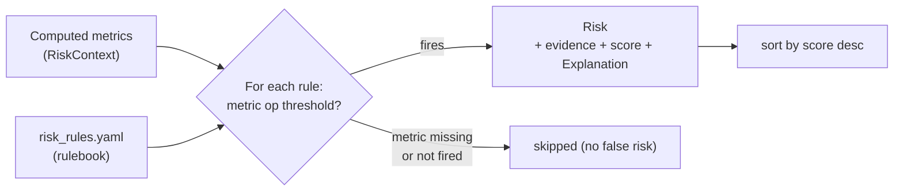

# Risk Engine — Rule-Based, Evidence-Backed

**Files:** `backend/app/engines/risk.py` and `backend/app/engines/risk_rules.yaml`

The Risk Engine is **deterministic and rule-based — there is no black-box scoring**. Every rule maps a *computed* project metric to a severity when a threshold is crossed. Nothing here guesses: every risk points at the exact metric, operator, and threshold that fired it, and carries an `Explanation` with the evidence.

## How It Works

1. Load the rulebook from `risk_rules.yaml`.
2. Build a `RiskContext` — a dictionary of **computed** project metrics (produced by the other engines: scheduling, resource, dependency, health, intake).
3. For each rule, look up its metric in the context. **If the metric is absent, the rule is skipped** — a missing metric never produces a false risk.
4. Apply the rule's comparison operator against its threshold. If it fires, emit a `Risk` with severity, probability, impact, score, evidence, recommended action, and an `Explanation`.
5. Return all triggered risks sorted by score (highest first).



## Rule Schema

Each entry under `rules:` in `risk_rules.yaml` has this shape:

```yaml
- rule_id: RISK_TESTING_WINDOW_MINIMUM      # stable identifier
  name: Insufficient Testing Window          # human title
  description: Testing starts too close to the deadline to be effective.
  category: testing_delay                     # grouping
  condition: {metric: testing_window_days, op: "<", value: null}
  threshold: 3                                # compared against the metric
  severity: high                              # low | medium | high | critical
  rationale: >                                # why this matters (goes into reasoning)
    A testing window under 3 days leaves no room to find and fix defects…
  evidence_required: [testing task start, deadline]
  recommended_action: Front-load test planning and begin testing earlier in parallel.
```

Supported operators (`op`): `>`, `>=`, `<`, `<=`, `==`, `!=`.

## Scoring Formula

Severity maps to both probability and impact on a 1..5 scale, then the score is normalised to 0..100:

```
severity  →  probability  &  impact
  low      →      2
  medium   →      3
  high     →      4
  critical →      5

score = (probability * impact) / 25 * 100
```

| Severity | prob × impact | Score |
| --- | --- | --- |
| low | 2 × 2 | 16.0 |
| medium | 3 × 3 | 36.0 |
| high | 4 × 4 | **64.0** |
| critical | 5 × 5 | 100.0 |

Example: `RISK_TESTING_WINDOW_MINIMUM` is `high`, so probability = impact = 4, score = `(4 × 4) / 25 × 100 = 64.0`.

## The Rulebook

The shipped `risk_rules.yaml` contains these rules (edit thresholds to tune organisational risk tolerance):

| rule_id | Metric | Condition | Severity |
| --- | --- | --- | --- |
| `RISK_RESOURCE_OVERLOAD` | `max_utilisation` | `> 1.0` | high |
| `RISK_SCHEDULE_COMPRESSION` | `schedule_pressure` | `> 1.0` | critical |
| `RISK_TESTING_WINDOW_MINIMUM` | `testing_window_days` | `< 3` | high |
| `RISK_SINGLE_POINT_OF_FAILURE` | `spof_count` | `> 0` | high |
| `RISK_UNASSIGNED_WORK` | `unassigned_tasks` | `> 0` | medium |
| `RISK_SKILL_MISMATCH` | `skill_gap_count` | `> 0` | high |
| `RISK_UNCLEAR_REQUIREMENTS` | `requirement_completeness` | `< 0.7` | high |
| `RISK_DEADLINE_INFEASIBLE` | `deadline_feasible` | `== 0` | critical |
| `RISK_DEPENDENCY_CONCENTRATION` | `dependency_density` | `> 1.5` | medium |
| `RISK_DOCUMENTATION_DELAY` | `documentation_ratio` | `< 0.5` | low |
| `RISK_DEMO_READINESS` | `demo_readiness` | `< 0.6` | high |
| `RISK_BUDGET_LIMITATION` | `budget_utilisation` | `> 0.9` | medium |
| `RISK_EXTERNAL_DEPENDENCY` | `external_dependencies` | `> 1` | medium |
| `RISK_SCOPE_CREEP` | `scope_change_count` | `> 2` | medium |

### Metric glossary

All metrics are computed deterministically by the engines:

| Metric | Meaning |
| --- | --- |
| `max_utilisation` | Highest member utilisation ratio (1.0 = 100% capacity) |
| `overloaded_members` | Count of members with utilisation > 1.0 |
| `schedule_pressure` | `project_duration / deadline` (>1 = infeasible) |
| `deadline_feasible` | 1 if the project fits the deadline, else 0 |
| `testing_window_days` | Days allocated for testing before the deadline |
| `spof_count` | Number of single-point-of-failure tasks |
| `unassigned_tasks` | Tasks with no owner |
| `skill_gap_count` | Required skills not present on the team |
| `requirement_completeness` | 0..1 intake completeness ratio |
| `dependency_density` | edges / nodes in the dependency graph |
| `documentation_ratio` | documentation tasks completed / planned |
| `demo_readiness` | 0..1 readiness for demo/submission |
| `budget_utilisation` | spend / budget (>1 = over budget) |
| `external_dependencies` | count of tasks blocked on external parties |
| `scope_change_count` | number of approved scope changes |

## Risk Output

Each triggered `Risk.to_dict()` contains: `rule_id`, `title`, `category`, `severity`, `probability`, `impact`, `score`, `evidence[]` (`{metric, operator, threshold, observed}`), `recommended_action`, and a full `explanation` (which triggers the `rule_id`, adds the rule's rationale, states the exact condition and observed value, and records the `risk_score` calculation).

## How to Add a Rule

1. Confirm the metric you want to gate on is (or can be) computed by an engine and placed into the `RiskContext`. If it's new, compute it in the relevant engine/agent and add it to the metric glossary at the top of `risk_rules.yaml`.
2. Append a new rule block to `risk_rules.yaml` with a unique `rule_id`, its `condition {metric, op, value}`, `threshold`, `severity`, a clear `rationale`, and a `recommended_action`.
3. That's it — no code change is required. The engine loads the YAML at startup and evaluates the new rule automatically.
4. Add a test in `tests/engines/` asserting the rule fires (and does **not** fire) at the boundary. See [TESTING.md](./TESTING.md).

Because rules are data, not code, product/PMO stakeholders can review and tune the organisation's risk tolerance directly in one auditable file.
