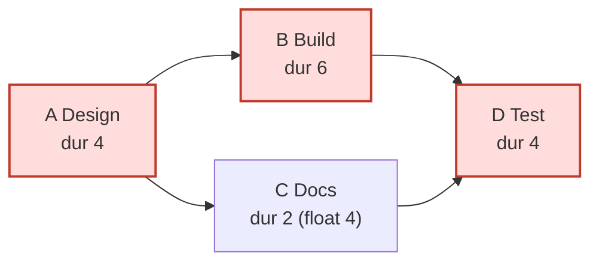

# Scheduling Engine — CPM + PERT

**File:** `backend/app/engines/scheduling.py`

The Scheduling Engine computes a project timeline deterministically using the **Critical Path Method (CPM)** with **PERT** three-point duration estimates — implemented from first principles, with no scheduling library. Every result carries an `Explanation` so a reviewer can see exactly how the timeline was derived. It requires a valid DAG (run the [Dependency Engine](./DEPENDENCY_ENGINE.md) first).

## Formulas

### PERT duration estimate

Given three-point estimates — Optimistic (`O`), Most likely (`M`), Pessimistic (`P`):

```
expected duration  =  (O + 4M + P) / 6
variance           =  ((P - O) / 6) ^ 2
```

If only a single `duration` is supplied, the engine treats `O = M = P = duration` (variance 0).

### CPM forward pass — earliest times

```
ES(task) = max( EF(pred) )  over all predecessors   (0 if none)
EF(task) = ES(task) + duration(task)
project_duration = max( EF )  over all tasks
```

### CPM backward pass — latest times

```
LF(task) = min( LS(succ) )  over all successors   (project_duration if none)
LS(task) = LF(task) - duration(task)
```

### Float and the critical path

```
total_float(task) = LS(task) - ES(task)   ( == LF - EF )
task is critical  <=> total_float ≈ 0     (|float| < 1e-9)
critical path     = the chain of zero-float tasks
```

### Project uncertainty and deadline metrics

```
project_std_dev   = sqrt( sum of variance along the critical path )
deadline_feasible = project_duration <= deadline
schedule_pressure = project_duration / deadline     (> 1 means infeasible)
```

Topological order is produced with **Kahn's algorithm** (deterministic — the ready set is sorted), and the forward/backward passes iterate that order.

## Worked Example

Four tasks with a diamond dependency shape: `A → B`, `A → C`, `B → D`, `C → D`.

| Task | O | M | P | Expected `(O+4M+P)/6` | Variance `((P−O)/6)²` |
| --- | --- | --- | --- | --- | --- |
| A (Design) | 2 | 4 | 6 | **4.0** | 0.444 |
| B (Build) | 3 | 5 | 13 | **6.0** | 2.778 |
| C (Docs) | 1 | 2 | 3 | **2.0** | 0.111 |
| D (Test) | 2 | 4 | 6 | **4.0** | 0.444 |

**Forward pass (ES/EF):**

| Task | ES | EF |
| --- | --- | --- |
| A | 0 | 4 |
| B | 4 | 10 |
| C | 4 | 6 |
| D | max(EF B, EF C) = 10 | 14 |

`project_duration = max(EF) = 14 days`.

**Backward pass (LS/LF), with project_duration = 14:**

| Task | LF | LS | Float = LS − ES | Critical? |
| --- | --- | --- | --- | --- |
| D | 14 | 10 | 0 | ✅ |
| B | 10 | 4 | 0 | ✅ |
| C | 10 | 8 | **4** | ❌ |
| A | min(LS B, LS C) = 4 | 0 | 0 | ✅ |

**Critical path:** `A → B → D` (the zero-float chain). Task **C has 4 days of float** — it can slip up to 4 days without moving the project end date.

**Project standard deviation** (sum of variances along the critical path):

```
CP variance = 0.444 (A) + 2.778 (B) + 0.444 (D) = 3.667
project_std_dev = sqrt(3.667) ≈ 1.915 days
```

**Deadline check** (say the hard deadline is 12 days):

```
deadline_feasible = 14 <= 12  →  false
schedule_pressure = 14 / 12   ≈ 1.167   (> 1 → infeasible)
```

Because the plan is infeasible, the engine triggers `SCHEDULE_INFEASIBLE`, records the reasoning, and offers alternatives: reduce scope of non-critical deliverables, parallelise independent critical-path tasks, or add capacity to critical-path owners. Downstream, the Risk engine's `RISK_SCHEDULE_COMPRESSION` rule fires on `schedule_pressure > 1.0`.

### Visualising the example



The red nodes (A, B, D) form the critical path; C is the only slack task.

## Output

`schedule(...)` returns a `ScheduleResult` whose `to_dict()` includes:

- `tasks[]` — per task: `duration`, `variance`, `earliest_start/finish`, `latest_start/finish`, `total_float`, `is_critical`, `predecessors`.
- `project_duration`, `project_std_dev`, `critical_path[]`.
- `deadline`, `deadline_feasible`, `schedule_pressure`.
- `gantt[]` — `{ task_id, label, start, end, critical }` for the frontend Gantt/timeline view.
- `explanation` — full reasoning, per-task critical-path evidence, and named calculations (`project_duration`, `project_std_dev`, `schedule_pressure`).

## Error Handling

If the supplied dependencies contain a cycle, `schedule(...)` raises a `ValueError` instructing the caller to run the Dependency Engine and resolve the cycle first — the timeline is never computed on an invalid graph.
