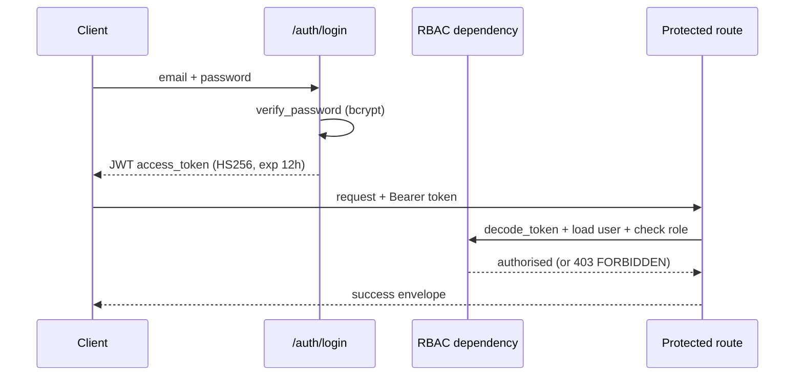

# Project Sentinel — Security

Security is implemented in `backend/app/core/security.py`, enforced by FastAPI dependencies, and configured via environment variables (`backend/app/config.py`). Sentinel follows least-privilege, defence-in-depth, and secrets-never-in-code.

## Controls

| Control | Implementation |
| --- | --- |
| **Authentication** | JWT, **HS256**, signed with `SECRET_KEY`. Tokens carry `sub`, `iat`, `exp` (default 12h lifetime). Issued by `create_access_token`, verified by `decode_token`. |
| **Password hashing** | **bcrypt** via `passlib` (`CryptContext`), configurable cost (`BCRYPT_ROUNDS`, default 12). Verification is constant-time and never throws on malformed input. |
| **Authorisation (RBAC)** | Role-based access enforced by a FastAPI dependency on protected routes. Roles: Admin, ProjectManager, TeamLead, Contributor, Viewer. |
| **Input validation** | All request bodies are **Pydantic** models — malformed input is rejected before it reaches business logic (`VALIDATION_ERROR`). |
| **File-upload validation** | Type allowlist (`pdf`, `docx`, `txt`, `csv`, `json`, `md`), size limit (`MAX_UPLOAD_MB`, default 25 MB), and **path-traversal-safe filenames**. |
| **Rate limiting** | Per-client cap (`RATE_LIMIT_PER_MINUTE`, default 120) → `RATE_LIMITED` on breach. |
| **CORS** | Explicit allowlist of origins (`CORS_ORIGINS`, defaults to the local frontend). |
| **SQL-injection safety** | All DB access via SQLAlchemy ORM — queries are parameterised by construction; **no raw SQL**. |
| **Audit logging** | Every agent run and material change is written to `audit_logs` with its `Explanation`, giving a tamper-evident trail. |
| **Secrets management** | All secrets (`SECRET_KEY`, LLM keys, S3 credentials) come from environment variables, never source. `SECRET_KEY` **must** be overridden in production. |

## Authentication Flow

## RBAC Role / Permission Matrix

Roles are stored in `roles`, granular permissions in `permissions`, linked to users via `user_roles` (and roles to permissions via a `role_permissions` association). The matrix below is the standard grant set. `own` = limited to resources the user is a member/owner of.

| Capability | Admin | ProjectManager | TeamLead | Contributor | Viewer |
| --- | :---: | :---: | :---: | :---: | :---: |
| View projects / reports / health | ✅ | ✅ | ✅ | ✅ (own) | ✅ (own) |
| Create / edit projects | ✅ | ✅ | ❌ | ❌ | ❌ |
| Upload documents & run RAG | ✅ | ✅ | ✅ | ✅ | ❌ |
| Run planning agents / workflow | ✅ | ✅ | ✅ | ❌ | ❌ |
| Edit WBS / tasks | ✅ | ✅ | ✅ | ✅ (assigned) | ❌ |
| Allocate resources | ✅ | ✅ | ✅ | ❌ | ❌ |
| Approve major changes (human-in-the-loop) | ✅ | ✅ | ❌ | ❌ | ❌ |
| Run simulations | ✅ | ✅ | ✅ | ❌ | ❌ |
| Trigger recovery / rescue | ✅ | ✅ | ❌ | ❌ | ❌ |
| Manage users & roles | ✅ | ❌ | ❌ | ❌ | ❌ |
| Edit risk rulebook / settings | ✅ | ❌ | ❌ | ❌ | ❌ |
| Read audit log | ✅ | ✅ | ❌ | ❌ | ❌ |

The engines and RAG never expose data outside the caller's authorised projects; per-project ChromaDB namespaces reinforce isolation at the retrieval layer.

## Human-in-the-Loop as a Security Control

Sentinel **recommends but does not unilaterally act** on major changes. Approval gates (baselining a plan, applying a recovery plan, large scope changes) require an Admin or ProjectManager, and each approval is audit-logged. This bounds the blast radius of any single automated decision.

## Hardening Checklist for Production

- Set a strong, unique `SECRET_KEY` (32+ bytes) and rotate periodically.
- Set `ENVIRONMENT=production` and `DEBUG=false`.
- Serve exclusively over TLS; restrict `CORS_ORIGINS` to real frontend origins.
- Use PostgreSQL with least-privilege DB credentials.
- Store LLM/S3 secrets in a secrets manager, injected as env vars.
- Keep `ALLOWED_UPLOAD_EXTENSIONS` tight and `MAX_UPLOAD_MB` conservative.
- Monitor `audit_logs` and rate-limit rejections.
