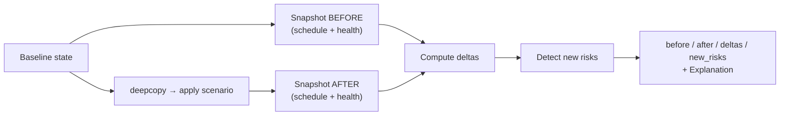

# Simulation Engine — Digital Twin

**File:** `backend/app/engines/simulation.py`

The Simulation Engine is a **deterministic digital twin** for what-if analysis. It snapshots the baseline project state, applies a scenario mutation to a *copy* of that state, then recomputes the schedule and health using **the same real engines** — so the twin behaves exactly like the live plan would. It returns a before/after comparison with deltas and any newly-introduced risks, all wrapped in an `Explanation`.

Crucially, the twin re-uses `SchedulingEngine` and `HealthEngine` directly. There is no separate "simulation model" that could drift from production behaviour.

## Inputs

```python
state = {
  "tasks": [...],            # PERT tasks (O/M/P)
  "dependencies": [...],     # DAG edges
  "deadline": float,
  "health_metrics": {...}    # metrics feeding the health engine
}
scenario = "<one of the supported keys>"
params   = { ... }           # scenario-specific
```

## Supported Scenarios

| Scenario | What it mutates |
| --- | --- |
| `member_unavailable` | Raises `max_utilisation` (×1.4) and increments `overloaded_members` — models losing a person |
| `deadline_shortened` | Subtracts `days` from the deadline |
| `task_delayed` | Adds `days` to a named task's O/M/P/duration |
| `add_requirement` | Appends a new task (and optional dependencies) to the plan |
| `scope_reduced` | Drops named tasks and any edges touching them |
| `dependency_blocked` | Adds `block_days` to a blocked task's duration |
| `testing_extended` | Extends test-labelled tasks and sets a `testing_window_days` |
| `capacity_increased` | Lowers `max_utilisation` (×0.75, floored at 0.3) — models adding capacity |

## How It Works



1. **Snapshot BEFORE** — run the scheduling engine (which also yields `schedule_pressure`) and feed metrics into the health engine.
2. **Apply the scenario** to a deep copy of the state (the baseline is never mutated).
3. **Snapshot AFTER** — recompute schedule and health identically.
4. **Compute deltas** and detect new risks.

## Deltas

```
project_duration delta = after.project_duration - before.project_duration
health delta            = after.health.overall  - before.health.overall
critical_path_changed   = before.critical_path != after.critical_path
```

## New-Risk Detection

The twin flags qualitative regressions that the scenario introduced:

- **"Scenario makes the deadline INFEASIBLE."** — when it was feasible before and is not after.
- **"Scenario drops health into rescue territory (<50)."** — when health crosses the rescue threshold that the scenario caused.

## Output

`simulate(...)` returns a `SimulationResult` whose `to_dict()` includes:

- `scenario` — the applied scenario key.
- `before` / `after` — each with the full `schedule` and `health` dictionaries from the real engines.
- `deltas` — `{ project_duration, health, critical_path_changed }`.
- `new_risks[]` — qualitative regressions introduced.
- `explanation` — states that the scenario was applied to a copy and recomputed with the same deterministic engines, and records `duration_delta` and `health_delta` calculations with their before/after inputs.

## Why This Matters

Because the digital twin recomputes with the production engines rather than an approximation, a stakeholder can trust that *"if we lose Priya for a week, the plan slips 6 days and health drops from Amber to Red"* is not a guess — it is the exact result the live plan would produce under that change. This powers the Digital Twin Simulation agent and the `/simulations` API.
